# Component reference

Every piece of the UI the apps are built from, one entry each: **what it is, when to use it, its arguments, a working example, how it behaves on
the server, what it is related to** (the React component behind it, the CSS, the translation keys, the functions it is used with)
and **a screenshot**. Screenshots were taken from the live apps (`shell_*`, `page_*`, `wizard_*`) and from the component
gallery (`cd_*`): run the gallery yourself with

```r
shiny::runApp("docs/gallery")      # from the datasuite.ui folder; rmncah (maroon) theme
# GALLERY_THEME=vaccine  or  GALLERY_THEME=pooled     # environment variable to see the other themes
```

Every image lives in [`img/`](img/). Read [`README.md`](README.md) first for how the pieces fit together, and
[`HOWTO.md`](HOWTO.md) for recipes.

**Which package.** Every entry is **datasuite.ui** (the kit: `R/kit-*.R`, `R/chart-options*.R`, `R/report-*.R`, `js/src`,
`inst/www`) unless its heading says **(cd2030.core)**: those are the Countdown pieces built on the kit -- `cd_app()`, the
standard nav sections, `cd_cfg()`, the filters, scoped and tabbed pages, the Load Data wizard, the shared analysis pages
and the Countdown report content -- in cd2030.core's `R/ui-*.R` and `R/report-countdown.R`, `R/report-preset-*.R`.

**Contents**
[Conventions](#conventions) ·
[1 App shell](#1-app-shell) ·
[2 Pages and the registry](#2-pages-and-the-registry) ·
[3 Filters and inputs](#3-filters-and-inputs) ·
[4 Cards, tabs and charts](#4-cards-tabs-and-charts) ·
[5 Tables and downloads](#5-tables-and-downloads) ·
[6 Feedback, files and dialogs](#6-feedback-files-and-dialogs) ·
[7 Actions](#7-actions) ·
[8 Shiny and translation helpers](#8-shiny-and-translation-helpers) ·
[9 The Load Data wizard](#9-the-load-data-wizard) ·
[10 Shared page modules](#10-shared-page-modules) ·
[11 Themes](#11-themes) ·
[12 The React side](#12-the-react-side) ·
[13 Reports page and report builder](#13-reports-page-and-report-builder)
([data model](#data-model-reporttypests) ·
[ReportStudio](#reportstudio) ·
[ReportEditor](#reporteditor) ·
[DeckEditor](#deckeditor) ·
[builder kit](#the-builder-kit-jssrccomponentsreportkit) ·
[ribbon](#ribbon-and-its-tabs) ·
[toolbars](#toolbars) ·
[document engine](#the-document-engine-flow) ·
[pictures](#pictures) ·
[panels and dialogs](#panels-and-dialogs) ·
[rich text](#the-rich-text-commands-richtexttsx) ·
[R module](#r-side-module-messages-actions) ·
[R functions](#r-side-the-report-functions))

---

## Conventions

* **Names.** Everything is `snake_case` and starts with `cd_` (`CONVENTIONS.md`). A Shiny module is a pair, `<stem>_ui()` and
  `<stem>_server()`. A React component `CdButton` is `cd_button()` in R.
* **Ids.** `id` / `inputId` arguments are *already namespaced* (`ns("x")`) unless the entry says it takes a module id.
* **Text is a translation key.** Any `label`, `title`, `hint`, `subtitle` argument takes a key (or the markup
  `i18n$t("key")` returns for one). A string that is not a key is shown as it is, in every language. React components receive
  every language at once (`cd_text()`), so they re-render themselves when the language changes.
* **Inputs are `shiny.react` inputs.** `input$<inputId>` holds the value. **Buttons are one-shot events**: `input$<id>` is
  `NULL` until the first click, so `observeEvent(input$<id>, ...)` needs no `ignoreInit`.
* **Pushing to a component.** `cd_update_input(inputId, session, value = ...)` changes a component that is already on the page, but
  only after it has *mounted*; a message to one that has not is lost. Wait with `cd_mounted()` / `cd_remounted()`.
* **`active`.** A page server takes `active`, a reactive that is TRUE once the page has been opened with data loaded and stays TRUE.
  Gate heavy work on `req(cache(), active())`.

---

## 1. App shell

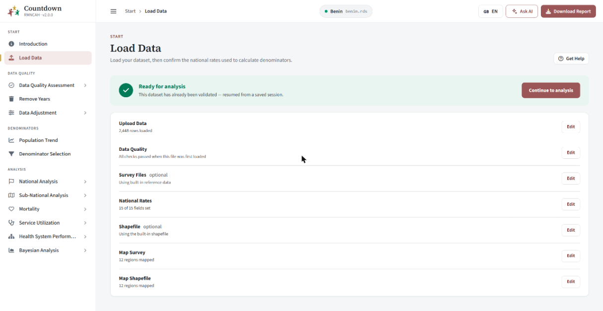

The shell is the frame around every page: the **header** (logo, breadcrumb, dataset pill, language switch, Ask AI, Download
report), the **sidebar** (sections, groups, locked items) and the **content area**. An app never builds these; it calls
`app_frame()` -- a Countdown app calls cd2030.core's `cd_app()`, which is `app_frame()` with the Countdown start screens.

### `app_frame()` and `cd_app()` (cd2030.core)

Both build the whole app (page, sidebar/header, server) and return the `shinyApp`; it is what an app's `run_app()` returns.
`app_frame()` is the kit's, and its arguments are in the package README ("`app_frame()` in short"); `cd_app()` adds the
Introduction and Load Data screens, the Countdown data readiness rules and the denominator row, so a Countdown app passes:

```r
cd_app(app_name, app_version, theme, nav_sections, registry, i18n, language, selected_file,
       upload_ui = upload_data_ui, upload_server = upload_data_server)
```

| Argument | Meaning |
| --- | --- |
| `app_name`, `app_version` | shown under the logo (`Countdown` / `RMNCAH · v2.0.0`) |
| `theme` | `NULL`/`"rmncah"` (maroon), `"vaccine"` (blue), `"pooled"` (green) - see [Themes](#11-themes) |
| `nav_sections` | the nav tree: a list of `cd_nav_section()` |
| `registry` | the page registry (the app's `R/pages.R`, e.g. `rmncah_pages()`) |
| `i18n`, `language` | the translator and the starting language |
| `selected_file` | the dataset DataSuite passed (`CDSUITE_SHINY_SELECTED_FILE`), or `NA` |
| `upload_ui`, `upload_server` | the app's Load Data screen (its part of the wizard) |

What the server it builds does (so you do not have to): starts `introduction_server()` and the app's `upload_server`; keeps
`data_ready` (a dataset with data has loaded) and `analysis_ready` (it has also been adjusted) and passes them to the sidebar so
items lock and unlock; snaps back to Load Data if a locked tab is reached another way; latches `page_is()` (`active`) per page;
keeps the language in sync between the picker and the dataset; renders the header dataset pill and the Download report button; and
starts every page and header server from the registry. **Related:** `cd_app_ui`, `cd_shell_server`, `cd_pages_ui/_server`; source
`R/kit-app.R` (`app_frame()`) and cd2030.core's `R/ui-core-app.R` (`cd_app()`).

### `cd_app_ui()`, `cd_app_bar()`, `cd_sidebar()`, `cd_app_body()`, `cd_screens()`, `cd_screen()`

The pieces `app_frame()` assembles; use them directly only for something that is not a normal app (the pooled app and the gallery do).

```r
ui <- cd_app_ui(theme = "pooled", title = "Pooled",
  header = cd_app_bar("Pooled", "2.0.0"), sidebar = cd_sidebar(),
  body = cd_app_body(usei18n(i18n), cd_head_assets(),
    cd_screens(cd_screen(tabName = "pooling", ...))))
```

* `cd_app_ui(header, sidebar, body, title, theme)` - the HTML page: jQuery, meta tags, the [start-up loader](#cd_startup_loader), the
  `cd-theme-<theme>` class on `<body>`.
* `cd_app_bar(app_name, app_version)` - the header. Its right-hand outputs (`cd_header_crumb`, `header_pill`, `download_buttons`,
  `cd_header_actions`) are rendered by `cd_shell_server()` and by `app_frame()`.
* `cd_screens(...)` / `cd_screen(tabName, ...)` - the top-level page containers (`div#cd-page-<tabName>`); exactly one is shown, switched
  by the sidebar (`nav.ts`).
* `cd_app_body(...)` - the padded content area.

### `cd_nav_section()`, `cd_nav_item()` and the standard sections

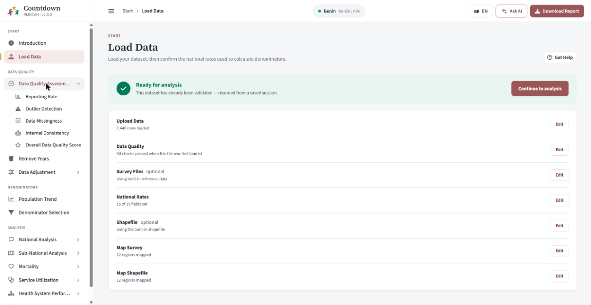

The sidebar is data: a list of sections, each a list of items.

```r
cd_nav_section("lbl_nav_section_quality",
  cd_nav_item("title_nav_quality", icon = "check-circle", children = list(          # a group (no tabName)
    cd_nav_item("title_rr_main", tabName = "reporting_rate", icon = "chart-bar"))),  # a leaf
  cd_nav_item("btn_adjust_remove_years", tabName = "remove_years", icon = "trash"))
```

| Function | Arguments |
| --- | --- |
| `cd_nav_section(label, ...)` | `label`: translation key of the small uppercase heading; `...` the items |
| `cd_nav_item(label, tabName, icon, i18n, children, requires_adjustment)` | a leaf has `tabName` (matches a `cd_screen()` and a registry `id`); a group has `children`. `icon` is a Font Awesome name. `requires_adjustment = TRUE` locks it until Data Adjustment has run (only set on top-level items) |

**(cd2030.core)** The sections every Countdown app shares: `cd_nav_start()` (Introduction, Load Data), `cd_nav_quality()` (Data Quality, Remove Years, Data
Adjustment), `cd_nav_denominators()`, `cd_nav_national(extra = list())` and `cd_nav_subnational()` (`extra`: more items for that group,
e.g. rmncah's Continuum of Care). An app composes them and adds its own groups:

```r
cd_nav_sections <- list(cd_nav_start(), cd_nav_quality(), cd_nav_denominators(),
  cd_nav_section("lbl_nav_section_analysis", cd_nav_national(), cd_nav_subnational()))
```

Locking: everything except Introduction and Load Data is locked (padlock, greyed) until a dataset has loaded; a click on a locked item
shows a notification (`err_nav_locked`). **Related:** `cd_shell_server()`, React `Sidebar`, `nav.ts`; source `R/kit-shell.R` (and cd2030.core's
`R/ui-layout-nav-sections.R` for the standard sections).

### `cd_shell_server()`

`cd_shell_server(output, sections, initial_tab, data_ready, analysis_ready = data_ready, i18n, docs_href)` renders the sidebar, the
breadcrumb and the header actions, and locks items as `data_ready()` / `analysis_ready()` change. `app_frame()` calls it; call it yourself
only in a custom app, with `data_ready = reactive(TRUE)` if nothing needs locking.

### `cd_startup_loader()`


A full-page white cover with the logo, a spinner in the theme colour and a random message, shown until the first `shiny:idle` (or
`timeout` seconds, default 20) and then faded out and removed. `cd_app_ui()` puts it first in `<body>` (its critical style is inline so
it covers the page before `cd-ui.css` applies), so do not add it yourself. `messages` is the list it picks from. It replaced the
waiter/hostess packages.

### `cd_head_assets()`

`<head>` tags: `cd-ui.css`, `fonts.css`, `i18n-fix.js` (a workaround for a shiny.i18n bug that logged an error on every language change),
each with `?v=<file mtime>` so browsers do not keep an old copy. Put it once in `cd_app_body()`.

### `cd_cfg()` (cd2030.core)

`cd_cfg(key, default = NULL)` reads the app's `options(cd2030.config = list(...))`; a value may be a function, evaluated when read. This is
how the shared Countdown pages get the things that differ per app. Keys are listed in cd2030.core's `R/ui-core-config.R` and in
`README.md`. Read it inside functions
(at call time), never at the top level of a file: top-level code runs before the app has set its options.

---

## 2. Pages and the registry


An analysis page is a *module* (`<name>_ui`, `<name>_server`) plus one **registry entry** in the app's `R/pages.R`. The registry holds
everything about a page that is not its content: title, section, subtitle, help chapter, whether it shows the denominator row, the report
key. So a module never repeats them and `app_frame()` can build all page containers, headers and servers from one list.

### `cd_page_def()`, `cd_use_pages()`, `cd_page_meta()`

```r
cd_page_registry <- list(
  cd_page_def(
    id = "national_target",                     # the tab name AND the module id
    ui = national_target_ui, server = national_target_server,
    title = "title_nav_global_coverage",        # translation keys
    section = "title_nav_national_analysis",    # the small heading above the title
    subtitle = "sub_target_national",
    help = c("national-global-coverage"),       # c(help chapter, optional section) for Get help
    denominator = TRUE,                         # show the "Denominator" row under the header
    report = NULL,                              # key used by Generate report / Add notes, if the page has them
    server_args = list(),                       # extra arguments for the server
    active = TRUE                               # FALSE: the server is not given `active`
  )
)
cd_use_pages(cd_page_registry)                  # once, before the app is built (in run_app())
```

`cd_page_meta(id)` returns one entry (used by `cd_page_ui()`). A page with `report` set gets a **Generate report** button in its header
(`page_denominator_selection.png` shows one).

### `cd_page_ui()`

`cd_page_ui(id, i18n, ..., filters = NULL)` is a page module's whole UI: it looks the page up in the registry, builds the header, the optional
filter bar (`filters = cd_filter_bar(...)`) and the content (`...`). Use it for every registry page.

```r
my_page_ui <- function(id, i18n) {
  ns <- NS(id)
  cd_page_ui(id, i18n,
    filters = cd_filter_bar(cd_indicator_ui(ns("indicator"), i18n)),
    cd_chart_card(...), cd_table_card(...))
}
```

### `cd_pages_ui()`, `cd_pages_server()`

Used by `app_frame()`: `cd_pages_ui(pages, i18n)` builds one `cd_screen()` per entry; `cd_pages_server(pages, cache, i18n, page_is)` starts each page
server with `active = page_is(id)` and each page's header server. You only call them in a custom app.

### `cd_page_header()` and `cd_denominator_row()` (cd2030.core)


The title block: eyebrow (section), title, subtitle, and the buttons on the right (Get help, and, when the registry asks, Add notes and
Generate report), plus the optional **denominator row** (which denominators the numbers were divided by).

```r
cd_page_header(id, title, i18n, include_report = FALSE, include_notes = FALSE, include_help = TRUE,
               eyebrow = NULL, subtitle = NULL, include_denominator = FALSE)
cd_denominator_row(vaccination, maternal = NULL, i18n)          # maternal chip only when given
cd_page_header_server(id, cache, path, section = NULL, i18n, key = id)
```

`cd_page_ui()` builds this from the registry and `cd_pages_server()` starts the server half, so call these directly only for a page that is
not in the registry (the Load Data page: `cd_page_header(id = ns("load_data"), ...)` then `cd_page_content(...)`). The denominator row shows
the maternal chip only when the app's group has a maternal denominator (`cd_has_maternal()`). `cd_page_header()` is the kit's;
`cd_denominator_row()` is cd2030.core's, which adds it to every page header through `app_frame(page_header_extra =
cd_denominator_header)`.

### `cd_page_body()`, `cd_page_content()`, `cd_tag_assert()`

`cd_page_body(dashboardId, dashboardTitle, i18n, ..., filters, ...)` is what `cd_page_ui()` calls (header + filters + content); `cd_page_content(...)` is
the padded content wrapper. `cd_tag_assert()` is an internal shape check for the pieces passed to `cd_app_ui()`.

### Scoped pages: `cd_scope()`, `cd_scoped_page_ui()`, `cd_scoped_page_server()` (cd2030.core)

Pages that are *the same analysis at a different geography* (national vs sub-national coverage, target, inequality) differ only in which admin-level
filters they show and what admin level / region they hand to the analysis module. A scoped page says just that.

```r
cd_scope(kind = c("national", "level", "region", "level_region"), fixed_level = NULL, show_district = FALSE)
```

| `kind` | Filters shown | The analysis gets |
| --- | --- | --- |
| `"national"` | none | `admin_level = "national"`, no region |
| `"level"` | an admin-level chip | the chosen level, no region |
| `"region"` | a region chip only | `fixed_level` (default `"adminlevel_1"`) and the region |
| `"level_region"` | both chips (`show_district = TRUE` lets districts be picked as regions) | level and region |

```r
subnational_target_ui <- function(id, i18n)
  cd_scoped_page_ui(id, i18n, cd_scope("region", fixed_level = "district"), target_ui)
subnational_target_server <- function(id, cache, i18n, active = reactive(TRUE))
  cd_scoped_page_server(id, cache, i18n, cd_scope("region", fixed_level = "district"), target_server, active)
```

The inner module has the signature `inner_ui(id, i18n, ...)` and `inner_server(id, cache, i18n, admin_level, region, active)`. `cd_scope_filters()` and
`cd_scope_server()` are its two halves. **Related:** `cd_admin_level_ui/_server`.

---

## 3. Filters and inputs

Filters live in a **filter bar**: chips (small pill buttons that open a popover) for the values that apply to a whole page, or, further down a
page, an inline **map options** bar. Larger forms use the always-visible *field* inputs.

### `cd_filter_bar()`


`cd_filter_bar(..., i18n, lead = "lbl_filter_scope_page", class = NULL)` - the one-line bar just under the header, sticky while the page scrolls, full
width. `lead` is its small label (default "All charts on this page"). Pass it as `cd_page_ui(filters = )`. In a real page it looks like the top of
`page_data_missingness.png` (Indicator, Admin Level, Admin 1). **Related:** `cd_map_options()` (the inline variant), the chips below.

### `cd_map_options()`


The **inline** filter bar for the options of a *group of maps* (years, palette). It is not sticky and not full-bleed: put it directly above the
map cards so it is clear it applies to them, not to the whole page.

```r
cd_map_options(
  cd_chip_multi(ns("years"), "title_global_select_years", i18n = i18n),
  cd_palette_chip(ns("palette"), i18n))
```


Its label is `lbl_filter_scope_maps` ("Map options"). **Related:** `cd_filter_bar` (it is `cd_filter_bar(class = "cd-filterbar--inline")`), `cd_palette_chip`,
`cd_years_input`.

### `cd_chip_select()`

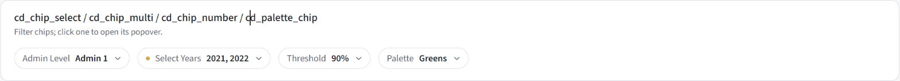

A single-choice chip: shows "label **value**" and opens a small list.

```r
cd_chip_select(inputId, label, choices = NULL, i18n, selected = NULL, hint = NULL, default = NULL,
               options = NULL, key = NULL, allow_empty = FALSE)
```

| Argument | Meaning |
| --- | --- |
| `choices` | `c(<translation key> = "value")`; the value goes to `input$<inputId>` |
| `options` | build the list yourself for data-driven lists (regions, years): `cd_plain_options(values, groups)` |
| `selected` | initial value; **defaults to the first option**. Use `""` when the real value comes from the cache and will be pushed in |
| `hint` | translation key of a tooltip shown in the popover |
| `default` | when given, the chip is highlighted while it differs from `default` and offers a Reset |
| `key` | a changed `key` makes React remount the chip, which resets it to `selected` (used when the list changes underneath) |
| `allow_empty` | let the chip hold no value (denominator chips, which are filled from the cache) |

```r
cd_chip_select(ns("admin"), "title_global_admin_level",
               choices = c(opt_adminlevel_1 = "adminlevel_1", opt_district = "district"), i18n = i18n)
# server: input$admin;  cd_update_input("admin", session, value = "district")
```

**Related:** React `ChipSelect` (with `ChipFrame`, `OptionList`, `usePopover`); `cd_options()`, `cd_plain_options()`, `cd_chip_texts()`.

### `cd_chip_multi()`

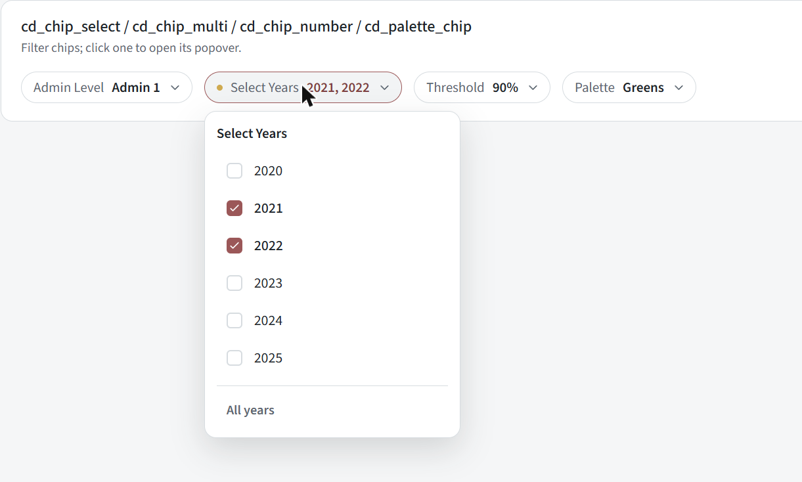

A multi-choice chip (several years). Choosing **nothing means "all"**, and reaches the server as `""`.

```r
cd_chip_multi(inputId, label, choices = NULL, i18n, selected = NULL, hint = NULL, options = NULL, all_label = "lbl_all_years")
cd_years_sync(input, session, id = "years", years, selected)      # (cd2030.core) keeps its options and value in sync with the cache
cd_years_input(value, all_years)                                   # (cd2030.core) its value as integers; "" -> all_years
```

`""` is *all*, and `as.integer("")` is `NA`, and `NA` years plot nothing - so always turn the value into years with `cd_years_input()` before storing it:

```r
cd_years_sync(input, session, "years", years = reactive({ req(cache()); cache()$data_years }),
              selected = reactive({ req(cache()); cache()$mapping_years }))
observeEvent(input$years, cache()$set_mapping_years(cd_years_input(input$years, cache()$data_years)))
```

### `cd_chip_number()`

A chip that holds one number (a threshold), with optional quick picks. `cd_chip_number(inputId, label, i18n, value, min, max, step, unit = "", picks = NULL, default = NULL, hint = NULL)`. It validates min/max as
you type; `picks` is a vector of preset values shown as buttons. Example: Reporting Rate's *Performance Threshold* (`90%`).

### `cd_palette_chip()` (cd2030.core)

`cd_palette_chip(inputId, i18n, first = "Greens")` - the colour palette chip for maps: Greens, Blues, Reds, Purples (`first` is the one it opens with;
Mortality Mapping opens on Reds, Service Utilization on Purples). Its value is an RColorBrewer palette name the core map functions accept
(`get_filtered_mapping_data(..., palette =)`, `filter_mortality_summary(..., palette =)`, `prepare_mapping_service_utlization(..., palette =)`). Goes inside
`cd_map_options()`.

### `cd_field_number()`, `cd_field_select()`, `cd_checkbox()`, `cd_text_area()`

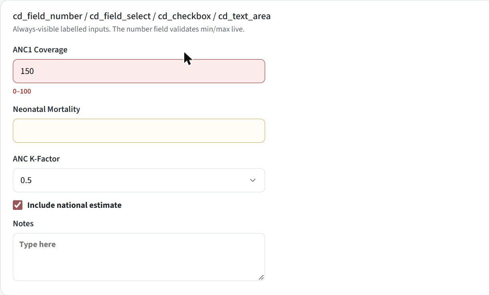

Labelled inputs that are always visible (forms, the wizard), not popover chips. Above: an out-of-range number is red with the range in place of the hint; a
required empty one is amber.

```r
cd_field_number(inputId, label, i18n, value = NULL, min = NULL, max = NULL, step = NULL, hint = NULL,
                required = FALSE, requiredLabel = NULL, unit = NULL)
cd_field_select(inputId, label, choices = NULL, i18n, value = NULL, hint = NULL, options = NULL)
cd_checkbox(inputId, label, i18n, value = FALSE, disabled = FALSE)          # input$<id> is TRUE/FALSE
cd_text_area(inputId, label = NULL, i18n, value = "", placeholder = NULL, height = 150)
```

* `cd_field_number`: validates min/max **live** and shows the message inline; `unit` is a trailing addon inside the field (`"%"`); with `required = TRUE` an empty
  field shows `requiredLabel` (amber). Its value is a number (or `NULL` when empty).
* `cd_field_select`: `value` is the selected value as a **string** (`"0.5"`); it does not pick a default by itself, so pass `value`.
* Push a value with `cd_update_input("k_anc", session, value = "0.5")`, after the field has mounted.
* `cd_text_area` height is in px.

**Related:** React `FieldNumber`, `FieldSelect`, `CdCheckbox`, `CdTextArea`; CSS `.cd-field-stack`, `.cd-field-grid`, `.cd-field-label`; `cd_button` for the form's action.

### `cd_admin_level_ui()` / `cd_admin_level_server()` / `cd_admin_parts()` (cd2030.core)


The admin-level chip plus the region chip (regions of that level, districts grouped under their parent).

```r
cd_admin_level_ui(id, i18n, include_national = FALSE, show_admin_level = TRUE)
cd_admin_level_server(id, cache, i18n, allow_select_all = FALSE, show_district = TRUE, show_region = TRUE,
                      show_admin_level = TRUE, selected_admin1 = reactive(NULL))
cd_admin_parts(admin)                          # list(admin_level = reactive, region = reactive)
```

The server returns a reactive `list(admin_level, region)`. `region` is `NULL` when the region chip is not offered or "all" is chosen.
`show_admin_level = FALSE` fixes the level to admin 1 (or district when `show_district`); `include_national` adds National to the level chip.

```r
filters = cd_filter_bar(cd_admin_level_ui(ns("admin"), i18n))
admin <- cd_admin_level_server("admin", cache, i18n)
parts <- cd_admin_parts(admin); admin_level <- parts$admin_level; region <- parts$region
```

The region chip keeps rendering while its page is hidden (`suspendWhenHidden = FALSE`) because the whole page waits for its value. **Related:** `cd_scope`
(builds this for you), `cd_region` options come from `cache()$subnational_regions`.

### `cd_indicator_ui()` / `cd_indicator_server()` (cd2030.core)

`cd_indicator_ui(id, i18n, label = NULL, tooltip = NULL, indicators = NULL, select_all = FALSE)` - an indicator chip; `indicators` defaults to `get_all_indicators()`
(so it follows the app's group); `select_all = TRUE` adds an "All" entry whose value is `""`. `cd_indicator_server(id)` returns `reactive(input$indicator)`. Used on
Reporting Rate, Outlier Detection, Data Missingness and in the Custom tab. The tooltip is a translation key.

### `cd_denominator_ui()` / `cd_denominator_server()` and helpers (cd2030.core)

`cd_denominator_ui(id, i18n, allow_input = FALSE, is_maternal = FALSE)` / `cd_denominator_server(id, cache, i18n, label, allowInput = FALSE, is_maternal = FALSE, display_mode = "combined")`.
A chip kept in sync with the cache's vaccination (or maternal) denominator; choosing writes it to the cache. Helpers:

| Function | Purpose |
| --- | --- |
| `cd_denominator_options()` | the options offered: `options(cd2030.denominator_choices)` or the rmncah default |
| `cd_has_maternal()` | `cd_cfg("has_maternal")`, falling back to "the group is not vaccine" |
| `cd_only_denominators(x)` | keep the entries of a named list/vector that are denominators this app offers (plus `"un"`); used for chart legends |

### `cd_population_ui()` / `cd_population_server()` (cd2030.core)

The population-source select on Denominator Assessment (`cd_population_ui(id)`, `cd_population_server(id, cache)`); it keeps the cache's derivation population in sync.

---

## 4. Cards, tabs and charts

### `cd_card()`

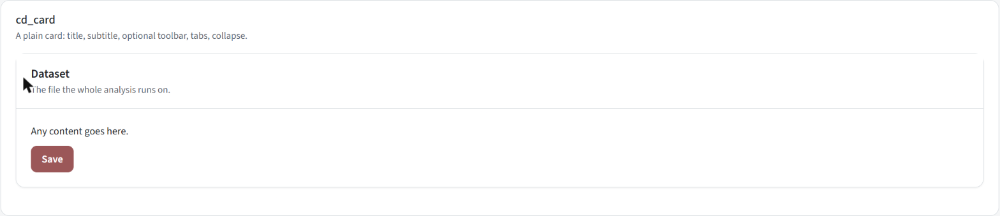

The basic card. Use it for forms and static content; a chart or table has its own wrapper below.

```r
cd_card(..., title = NULL, subtitle = NULL, footer = NULL, status = NULL, solidHeader = FALSE, background = NULL,
        width = NULL, height = NULL, collapsible = FALSE, collapsed = FALSE, toolbar = NULL, tabs = NULL, icon = NULL, i18n)
```

`title` / `subtitle` are translation keys (rendered by the React `CardHeader`, so they change language live); `status` tints the card (`"success"`, `"danger"`);
`toolbar` is UI shown top-right of the header; `tabs` a tab strip shown under the header; `collapsible` adds a collapse toggle; `icon` a Font Awesome name
before the title; `width` is accepted and ignored (a card is always a full-width block - use `cd_card_row()` for two side by side).

### `cd_chart_card()`, `cd_table_card()`, `cd_card_row()`


A card pre-wired for a chart, with the standard chart tool row in its header:

```r
cd_chart_card(title, chart_toolbar, ..., i18n, tabs = NULL, width = 6, icon = NULL)
```

`chart_toolbar` is the tool row for the chart that is showing (`cd_plot_toolbar_ui(ns("c"))`, or a `uiOutput` that resolves to one for a tabbed card whose chart changes);
`tabs` a `cd_tab_strip()`. The header holds, left to right: Ask AI, a divider, the chart's tools (view options, labels, download image, download data), expand.
`cd_table_card(title, ..., i18n, table_toolbar = NULL, width = 6)` is the table equivalent (only a download button and expand). `cd_card_row(...)` puts two cards on one row:


In a narrow card (a half-width card in a row, or a small window) the optional tools fold behind a **"..."** button (`cd-tool-optional`, `cd_more_tools_button()`),
leaving Ask AI and the camera; and a collapse chevron appears (`cd_collapse_chevron()`). Parts: `cd_card_header`, `cd_chart_toolbar`, `cd_table_toolbar`.

### `cd_plot_ui()` / `cd_plot_server()` - a chart with its tools

The chart itself: a plot output with the standard tools.

```r
cd_plot_ui(id, toolbar_inline = FALSE)
cd_plot_server(id, i18n, plot_data, plot_fun, plot_filename = reactive("plot"),
               plot_label_key = "btn_global_download_plot", plot_extension = reactive("png"),
               data_label_key = "btn_global_download_data", data_extension = reactive("xlsx"),
               excel_write_fun = NULL, excel_sheet = NULL, excel_title = NULL)
```

| Argument | Meaning |
| --- | --- |
| `plot_data` | a **reactive** of the data the plot draws |
| `plot_fun` | `function(d)` returning a ggplot (or drawing base graphics); it gets the *evaluated* data |
| `plot_filename` | reactive; the download's base name (a timestamp is added) |
| `excel_sheet` / `excel_title` | translation keys of the sheet name and an optional title - enables **Download data** for the one-sheet case |
| `excel_write_fun` | `function(wb, d)` for anything else (several sheets, other data); use `cd_add_sheet()` |
| `toolbar_inline` (ui) | `FALSE`: the tool row overlays the chart. `TRUE`: the tools are rendered elsewhere (in `cd_chart_card(chart_toolbar = cd_plot_toolbar_ui(id))`) |

```r
# UI
cd_chart_card("title_consist_ratio_plots", chart_toolbar = cd_plot_toolbar_ui(ns("ratios")), i18n = i18n,
              cd_plot_ui(ns("ratios"), toolbar_inline = TRUE))
# server
cd_plot_server("ratios", i18n = i18n,
  plot_data = reactive({ req(cache(), active()); cache()$ratios_summary }),
  plot_fun = function(d) plot(d, title = i18n$t("plt_title_consist_ratios")),
  plot_filename = reactive("ratio_plot"), excel_sheet = "ratio_plot")
```

The **Customize** tool (the sliders icon) is one panel for everything about how a chart looks. It edits **this chart only**, and an **Apply to** switch says where: **Screen** (this chart, also used for its downloaded image), **Report** (the generated report), or **Both**.

- **Chart ids.** Every chart has an id, from the app's `report_register(chart_id = )` (else `cd_chart_type()`). Countdown's is made from the data it draws: `cd2030.core::cd_chart_id()` = kind of data . admin level . indicator, e.g. `coverage_filtered.national.anc4`. The panel shows it under its title. Ids are grouped by their parts: everything starting `coverage_filtered.national` is the national coverage charts. The app and the reports build the id the same way (every `plot()` method passes the data it was given to `cd_finish_plot(.source = )`), so a **Report** setting saved for a chart reaches the same chart in a generated report, with no chart id written in the template. A chart whose data does not say what it is (no admin level or indicator) is identified by its data kind alone, and one with no kind by its type of graph (`cd_chart_type()`).
- **By chart element** (`ChartElements.tsx`), as PowerPoint's Format pane: Chart title, Subtitle, Source note, Horizontal/Vertical axis title, Horizontal/Vertical axis labels, Legend, Legend title, Data labels, Gridlines, Bars/lines/points, Panel headings, Chart area, All text. Each is a section that opens to its own settings; its **first choice, in its header, is a Show switch** (`show_title`, `show_x_title`, `show_legend`, `show_labels`... in `cd_chart_options()`). Hidden leaves no space for the element; a hidden element says *Hidden* and its settings stay closed. **Search** finds an option across all elements by its name or a related word ("angle", "font", "colour", "percent").
- In the report builder the same switches are on the **Chart Design** tab's **Chart Elements** checklist (Excel's "+" button).
- Every changed option has a gold dot and its own reset; each option group has *Reset group*; the footer has *Reset all* (for the target selected). The count and the values shown are the report's when *Report* is selected, the screen's otherwise.
- The panel is a wide popover **fixed to the window** (under 720px wide it is a bottom sheet), so it never adds to the page's scroll.

**Adding an option:** one line in `CHART_FIELDS` (`R/kit-chart-schema.R`: key, element, group, control; a new element goes in `CHART_TABS` with its icon and its `show` option) and its translation key `lbl_style_f_<key>`. The panel (`ChartCustomize.tsx`, `ChartCustomizeFields.tsx`) draws whatever is listed there.

**Stored in the dataset.** The panel's values are `cd_chart_options()`, kept by `cache$set_chart_options(<chart id>, options)` for the screen (the chart's module path) and `cache$set_chart_options("report/<chart id>", options)` for reports, saved with the dataset. A report (`export_report()`, through `with_report_chart_options()`) draws every chart with the dataset-wide `"default"` options (set from R) then those saved for its type of graph, then those saved for the chart itself; options a report block passes win. Every cd2030.core `plot()` method takes `options =` (and any chart option by name in `...`): `plot(x, options = cd_chart_options(x_text_angle = 45, grid = "horizontal"))`. See `?cd_chart_options`.

**How it works.** `plot_fun` runs once per data change to build the ggplot; the chart options are applied on top of it (`cd_apply_chart_options()` in `R/kit-chart-state.R`; `cd_chart_layout()`, `cd_chart_axes()` and `cd_chart_label_defaults()` in `R/kit-chart-layout.R`), never inside `plot_fun`. The renderer `cd_render_plot()` shows a skeleton while calculating, rethrows errors (a red message in the card, never a silent blank)
and grows the plot when the card is expanded (`cd_plot_client_height()`). `cd_plot_output(id)` is the plain output. **Note:** `str_glue(i18n$t("template"))` inside `plot_fun` reads `{names}` from the function around it, so
define the variables the template uses (e.g. `vacc1`, `vacc2`) in `plot_fun` first. **Related:** React `ChartCustomize`, `ExpandButton`, `ToolFrame`; `cd_chart_customize()`, `cd_expand_button()`, `cd_ask_ai_button()`.

### `cd_tab_strip()`, `cd_tab_panes()`, `cd_update_tab_panes()`

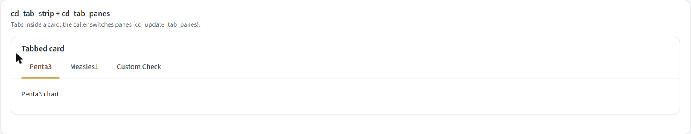

Tabs that switch content **in place** (they are real `<button>`s, not links).

```r
cd_tab_strip(ns, tabs, active)                              # tabs: c(key = "Label"); buttons have ids <ns>tab_<key>
cd_tab_panes(id, panels, active = names(panels)[[1]])       # panels: list(key = <ui>)
cd_update_tab_panes(session, id, selected)                  # in the server: show pane `selected`
```

The pattern (used by Reporting Rate, Outlier Detection, Consistency Checks and, generically, `cd_tabbed_charts_*`):

```r
# UI
cd_card(title = "Tabbed card", tabs = uiOutput(ns("tabs")), cd_tab_panes(ns("panes"), list(a = ..., b = ...)))
# server
current <- reactiveVal("a")
output$tabs <- renderUI(cd_tab_strip(ns, c(a = "Penta3", b = "Measles1"), current()))
lapply(c("a", "b"), function(k) observeEvent(input[[paste0("tab_", k)]], {
  current(k); cd_update_tab_panes(session, "panes", k)          # `tab_<k>`: the strip's button id
}, ignoreInit = TRUE))
```

Hidden panes are not computed (Shiny suspends hidden outputs), so only the visible tab's chart is built.

### `cd_tabbed_charts_ui()` / `cd_tabbed_charts_server()` - one tab per indicator (cd2030.core)


The standard card for a set of indicators: a tab per indicator plus, by default, a **Custom Check** tab.

```r
cd_tabbed_charts_ui(id, i18n, title_key, uiInput, indicators = NULL, customIndicators = get_analysis_indicators(),
                    showCustom = TRUE, width = 12)
cd_tabbed_charts_server(id, serverInput, indicators = NULL, customIndicators = get_analysis_indicators(),
                        showCustom = TRUE, selected_tab = reactive(NULL), i18n = cd_i18n())
```

| Argument | Meaning |
| --- | --- |
| `uiInput` | the per-tab UI function, normally `cd_coverage_plot_ui` |
| `serverInput` | `function(id, current_indicator)` building that tab's server, normally a `cd_coverage_plot_server()`. Called once per indicator, and once more with `id = "custom"` when a custom indicator is picked |
| `indicators` | the tab keys. `NULL` means the app default (`cd_default_indicator_set()`: `options(cd2030.default_indicators)`, a vector or a function) |
| `customIndicators` | what the Custom tab's picker offers (default: every analysis indicator of the group) |
| `showCustom` | show the Custom tab. **Pass the same value to both the `_ui` and the `_server` call**, or the strip and the panes disagree |
| `selected_tab` | a reactive that drives which tab is showing (National Inequality drives its map's tab) |

The server returns a reactive with the tab that is showing.

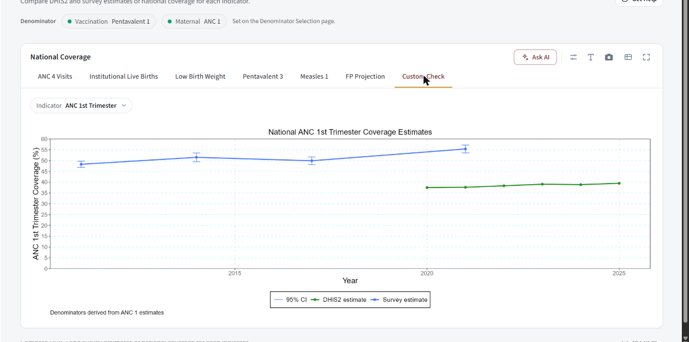
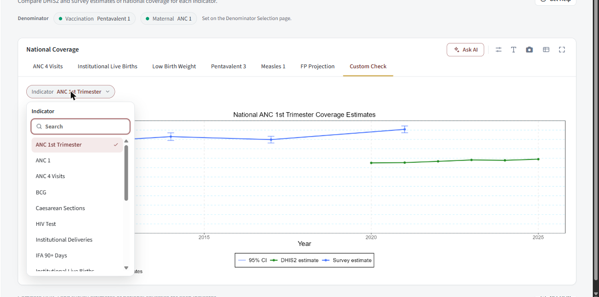

```r
# UI
cd_tabbed_charts_ui(ns("panel"), i18n, "title_target", cd_coverage_plot_ui, indicators = cd_cfg("target_indicators"), showCustom = FALSE)
# server
cd_tabbed_charts_server("panel", indicators = cd_cfg("target_indicators"), showCustom = FALSE,
  serverInput = function(id, current_indicator) {
    data <- reactive({ req(cache(), active()); cache()$get_filtered_coverage(indicator = current_indicator, admin_level = "national") })
    cd_coverage_plot_server(id = id, filename = reactive(current_indicator), data_fn = data,
                            sheet_name = reactive(i18n$t(paste0("opt_", current_indicator))), i18n = i18n)
  })
```

Tab labels are `opt_<indicator>` translation keys, so every indicator an app offers needs one. `cd_default_indicator_set()` is what "the app default" resolves to.

### `cd_coverage_plot_ui()` / `cd_coverage_plot_server()` (cd2030.core)

`cd_coverage_plot_ui(id, toolbar_inline = FALSE)`; `cd_coverage_plot_server(id, filename, data_fn, ..., sheet_name, i18n, plot_fun = NULL)`; `cd_coverage_plot_toolbar_ui(id)`.
`cd_plot_server` specialised for the tabbed cards. `filename` and `sheet_name` are reactives; without `plot_fun` it calls `plot(d, ...)` on the core data object
(the `...` are passed to the core `plot()` method: `title`, `x_label`, `legend_labels`, ...); with `plot_fun = function(d) ...` you draw it yourself. The Excel sheet is `sheet_name()` with the data (a `geometry` column
dropped). The id nests one level deeper (`<id>-plot`), which `cd_coverage_plot_toolbar_ui()` mirrors.

---

## 5. Tables and downloads

### `cd_table_ui()` / `cd_table_server()` (cd2030.core)


A `reactable` table card with a **Year** or **Indicator** selector chip, a "This table only" note and a data download.

```r
cd_table_ui(id, i18n, title_key, control_type = c("year", "indicator"), width = 6)
cd_table_server(id, cache, i18n, data, columns = NULL, control_type = c("year", "indicator"), filename = reactive("download"),
                label_key = "btn_global_download_data", extension = reactive("xlsx"), data_transform = NULL,
                excel_write_fun = NULL, excel_sheet = NULL, excel_title = NULL)
```

`data` is a reactive of the full table; the selector filters it by year (or indicator) and the chosen value is appended to the download's file name. `columns` is a named list of `reactable::colDef()`;
`data_transform` is a `function(data, selected)` applied after filtering. `cd_rate_status_cell(value)` draws a reporting-rate cell as a shape plus the value (red triangle below 70, amber diamond 70 to below 90, green circle from 90), for
`colDef(cell = )`.

### `cd_download_button_ui()` / `cd_download_button_server()`

One download button (an `<a class="shiny-download-link cd-button">` with a busy state). The chart and table servers build theirs; use it directly for a new download.

```r
cd_download_button_ui(id)
cd_download_button_server(id, filename, extension, content, data, i18n, label = "btn_global_download", message = "msg_downloading",
                          icon = "download", icon_only = TRUE, tooltip = NULL, button_class = NULL, show_when_no_data = FALSE)
```

`filename` / `extension` / `data` are reactives; `content(file, data)` writes the file (`data` is already evaluated). The button is **debounced** (300 ms) so it does not flicker while the data settles, is disabled while
`data()` is `NULL` (unless `show_when_no_data`), and shows `message` while the file is being built (`cd_download_status()` / React `DownloadButtonStatus`). `icon_only = FALSE` shows the label (the Load Data
"Download Master Dataset" button).

```r
cd_download_button_server("download_data", filename = reactive("master_dataset"), extension = reactive("dta"), i18n = i18n,
  data = reactive(cache()$countdown_data), icon_only = FALSE, label = "btn_upload_download_master",
  content = function(file, data) haven::write_dta(data, file))
```

### `cd_add_sheet()`, `cd_sheet_writer()`

Excel export helpers. `cd_add_sheet(wb, name, x, title = NULL)` adds a worksheet holding `x` (title in row 1 and data from row 3 when a `title` is given, else data from row 1; a spatial `geometry` column is dropped).
`cd_sheet_writer(i18n, sheet, title = NULL)` returns `function(wb, d)` for the one-sheet case (what `excel_sheet =` builds). More than one sheet:

```r
excel_write_fun = function(wb, d) {
  cd_add_sheet(wb, i18n$t("title_outlier_extreme"), cache()$outliers_national, title = i18n$t("tab_outlier_extreme"))
  cd_add_sheet(wb, i18n$t("lbl_sheet_outlier_district"), cache()$district_outliers_summary, title = i18n$t("tab_outlier_district"))
}
```

---

## 6. Feedback, files and dialogs

### `cd_button()`

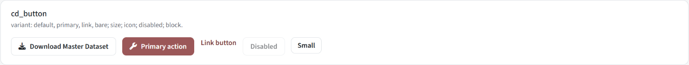

```r
cd_button(inputId, label = NULL, i18n, icon = NULL, variant = "default", size = "md", class = NULL, disabled = FALSE, block = FALSE, title = NULL)
```

`variant`: `"default"` (outlined), `"primary"` (filled with the theme colour), `"link"` (text), `"bare"` (no styling of its own; style it with `class`). `size`: `"sm"` / `"md"`. `icon`: a Font Awesome name. `block = TRUE` makes it full width. `title` is a
tooltip key. A click sets `input$<inputId>` to a fresh timestamp as a one-shot event. `label = NULL` gives an icon-only button. **Related:** React `CdButton`; CSS `.cd-button`, `.cd-button--primary`; used by
`cd_help_button_ui`, `cd_report_button_ui`, `cd_download_report_ui`.

```r
cd_button(ns("adjust_data"), "btn_adjust_execute", i18n, icon = "wrench", variant = "primary", block = TRUE)
observeEvent(input$adjust_data, { ... })
```

### `cd_status_banner()`

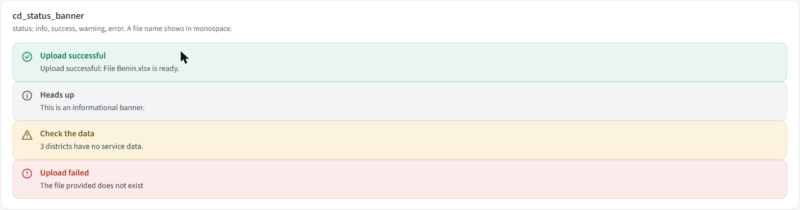

One always-visible banner: icon, bold title, description (and an optional monospace file name). `cd_status_banner(status, title, description = NULL, file = NULL, i18n, use_pre = FALSE)`; `status` is `"info"`, `"success"`, `"warning"` or
`"error"`. `title` is a key; `description` may be a key **or already-resolved text** (a dynamic error message). Example: `cd_status_banner("error", "title_upload_error_heading", st$message, i18n = i18n)`. **Related:** React `StatusBanner`, `StatusIcon`.

### `cd_message_ui()` / `cd_message_server()` / `cd_message_box()`


A message list that the server adds to, replaces and clears (upload progress, "adjusted / not adjusted").

```r
cd_message_ui(id, label = NULL, width = NULL)
msg <- cd_message_server(id, i18n = NULL, default_message = "msg_upload_awaiting", default_title = "title_msg_waiting", use_pre = FALSE, help_text = NULL)
msg$add_message(message, status = "info", parameters = NULL, title = NULL)
msg$update_message(message, status = "info", parameters = NULL, title = NULL)     # clear, then add
msg$clear_messages()
```

`message` and `title` are translation keys; `parameters` is a list filling `{placeholders}` in the translation (`list(details = "...")` for "The adjustment could not be applied: {details}"). Messages sent before the box has mounted are queued and delivered on
mount. `cd_message_box(id)` is the React renderer (`MessageBoxStatus`). Prefer `cd_status_banner()` for one fixed message.

### `cd_empty_state()`

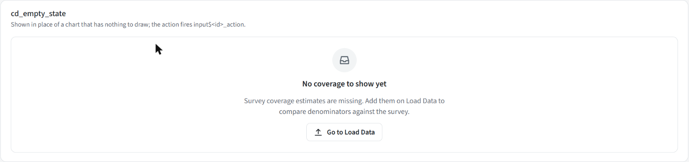

Shown in place of something with nothing to show (a comparison with no survey data). `cd_empty_state(id, title, message, i18n, action_label = NULL)`; all three texts are keys. The optional button fires the one-shot input `<id>_action`:

```r
cd_empty_state(ns("goto"), "title_denom_coverage_empty", "msg_denom_coverage_empty", i18n = i18n, action_label = "btn_denom_goto_load_data")
observeEvent(input$goto_action, cd_navigate_to(session, "upload_data"))
```

### `cd_loading_skeleton()` / `cd_spinner()`

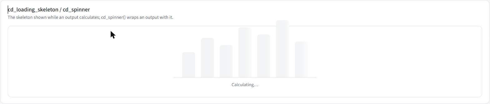

`cd_spinner(ui, i18n, min_height = NULL)` wraps any output; while it is calculating it shows a bar-chart skeleton with "Calculating...", and it swaps to the content when done. It starts in an "init" state (skeleton, output kept laid out but
invisible - not `display: none`, which would stop Shiny computing it) so a card never flashes "empty" first. `min_height` (px) is roughly the finished height, so the card does not resize. `spinner.ts` drives it from Shiny's
`recalculating` / `value` / `error` events; a *silent* error (a `req()` that is not ready) keeps the skeleton (for at most 4 s), a real error shows the message. `cd_loading_skeleton()` is the placeholder alone.

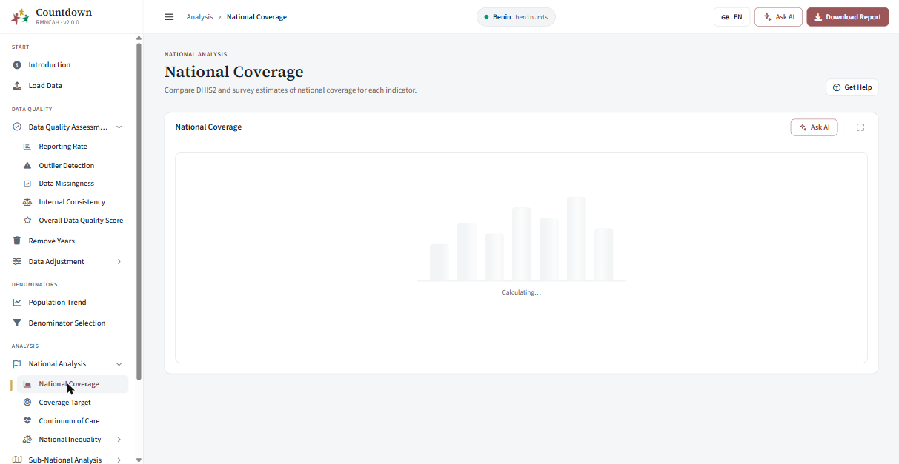

### `cd_tooltip()`

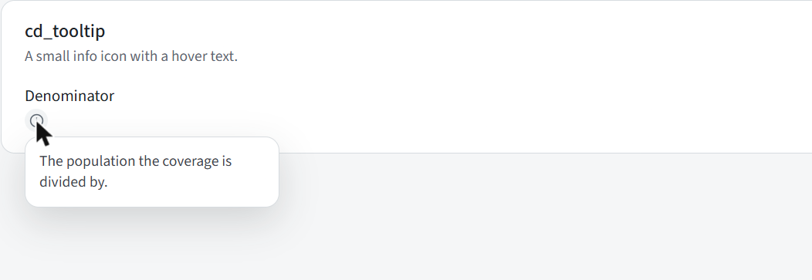

A small info icon with hover text: `cd_tooltip(text, label = NULL, status = NULL, i18n)` (`text` and `label` are keys; `status` tints the icon). Chips and fields take a `hint` argument instead, which shows the same kind of text in their popover.

### `cd_file_upload()`, `cd_directory_upload()`, `cd_reset_file_upload()`, `cd_set_file_upload()`


A drag-and-drop zone. Shiny's own file input does the upload (it is the real `<input type="file">` inside), so `input$<id>` is the usual data frame (`name`, `size`, `type`, `datapath`).

```r
cd_file_upload(id, label = NULL, hint = NULL, accept = NULL, i18n, multiple = FALSE)
cd_directory_upload(id, label = NULL, hint = NULL, accept = NULL, required_files = NULL, i18n)
cd_reset_file_upload(inputId, session)            # clear the zone
cd_set_file_upload(inputId, fileName, session)    # show `fileName` as the uploaded file (server truth)
```

`multiple = TRUE` takes several files (pooled uses it for `.rds` files); `cd_directory_upload` picks a folder (`required_files`: `c("<label key>" = "<filename prefix>")` shown as a checklist that fills in as files are chosen; the server still validates). The zone shows the file name with Replace / Reset once
a file is chosen. `cd_set_file_upload` / `cd_reset_file_upload` are plain custom messages (the zone is not a `shiny.react` input), so they need no mount check but do nothing if the zone is not there. **Related:** React `FileUploadZone`;
the wizard's upload steps (`upload_box_ui`, `survey_upload_ui`, `shapefile_step_ui`).

### `cd_show_dialog()` and friends


The replacement for `showModal()`. The dialog is ordinary markup inserted into the page, so inputs inside it are ordinary Shiny inputs.

```r
cd_show_dialog(title, ..., footer = NULL, easy_close = FALSE, size = c("md", "lg"), session)
cd_remove_dialog(session)
cd_dialog_close_button(label, primary = FALSE)      # a footer button that only closes it
cd_dialog(title, ..., footer, easy_close, size)     # the markup, if you need it as UI
```

One dialog at a time (id `cd-dialog`; showing another replaces it). `easy_close = TRUE` also closes on Escape or a click outside. `dialog.ts` handles closing. Example:
`cd_show_dialog("Delete this dataset?", p("This cannot be undone."), footer = tagList(cd_dialog_close_button("Cancel"), cd_dialog_close_button("Delete", primary = TRUE)))`. Used by Add notes and the region-mapping modal.

### `cd_mapping_modal()`

`cd_mapping_modal(id, label, title, regions, choices, existing = NULL, i18n)` - the "match your regions to the shapefile's" dialog content (React `MappingModal`): a search box, one row per region with a selector, an
auto-match on open (case, accent and fuzzy matches are tagged so the user can tell why), and duplicate / unmapped warnings. It is used by the wizard's mapping steps (`mapping_modal_ui/_server`); `cd_mapping_texts()` bundles its labels.

---

## 7. Actions

Page-level buttons in the header of a page (`cd_page_header()` builds them from the registry).

| Function | What it does |
| --- | --- |
| `cd_help_button_ui(id, name, i18n)` / `cd_help_button_server(id, path, section = NULL, cache)` | **Get help**: opens the documentation site in the browser, in the dataset's language (`datasuite.vercel.app/<lang>/docs/framework/`), at `#section` when the registry gives one |
| `cd_notes_button_ui(id, i18n)` / `cd_notes_button_server(id, cache, document_objects, page_id, page_name, i18n)` | **Add notes**: a dialog to attach a note to an object on the page, which goes into the report |
| (the header's `include_report` button, `cd_page_header_server()`) | **Generate report**: opens the Reports page with the page's standard report (`cd_request_report(session, key)`), ready to be named |
| (the app bar's report button, `app_frame()`) | opens the Reports page (shown once data is ready and the app has a Reports page, `cd_has_reports()`) |

---

## 8. Shiny and translation helpers

### Talking to components (`R/kit-shiny.R`)

| Function | Purpose |
| --- | --- |
| `cd_update_input(inputId, session, ...)` | push props (`value`, `options`, `editable`, ...) to a React input already on the page |
| `cd_mounted(input, id)` | a reactive TRUE once the React component `id` has mounted (first time only) |
| `cd_remounted(input, id)` | reflects **every** mount - use it for something that can be torn down and rebuilt (a wizard step re-entered from the landing page) so you re-sync each time |
| `cd_navigate_to(session, tab_name)` | move to a sidebar tab from the server (Load Data's "Continue to analysis") |
| `cd_set_language(session, lang)` | tell every React component the language changed (also call `shiny.i18n::update_lang(lang)` for plain text) |

```r
mounted <- cd_mounted(input, "years")
observeEvent(list(years(), mounted()), { req(mounted()); cd_update_input("years", session, options = cd_plain_options(years())) })
```

### Translation (`R/kit-i18n.R`)

| Function | Purpose |
| --- | --- |
| `cd_use_i18n(i18n)` / `cd_i18n()` | register / read the app's translator; components default their `i18n` to it |
| `cd_text(i18n, key)` | a key as `list(en =, fr =, pt =)`, what React components take |
| `cd_plain_text(i18n, key, lang = NULL)` | a key as plain text in one language (the current one by default); the key itself if missing |
| `cd_label(i18n, x)` | a key -> its text in every language; anything else -> shown as is |
| `cd_key(x)` | unwrap the markup `i18n$t()` returns back to the key |
| `cd_label_glue(i18n, template_key, ...)` | a template with `{placeholders}` filled from other keys' text, per language |
| `cd_options(choices, i18n)` | `c(<key> = value)` -> option list with translated text |
| `cd_plain_options(values, groups = NULL)` | data as options (regions, years); `groups` adds group headings |
| `cd_chip_texts(i18n)` | the shared text every chip needs (Reset, Search, ...) |
| `cd_translations(app_file, extra = character())` | merge the kit's `inst/translation/ui.json`, every file registered with `cd_register_translations()`, the app's file (+ `extra` files) into one temp JSON for `init_i18n()`; later layers win |
| `cd_register_translations(path)` | add a package's translation file to the layers (cd2030.core registers `cd2030.json` in its `.onLoad()`) |
| `cd_read_translation_file(path)` | one translation file as a list of entries |

### Assets and plumbing (`R/kit-assets.R`)

`cd_react_element(name, props)` builds a `shiny.react` element for the component `name` in the bundle; `cd_react_dependency()` is the bundle's HTML dependency; `cd_icon_class(icon)` resolves a Font Awesome icon *name* to its CSS class (what React
components take).

---

## 9. The Load Data wizard

**(cd2030.core**, `R/ui-wizard-*.R`; only the step rail, `cd_wizard_steps()`, is the kit's.) The wizard is how a dataset gets into an app. Seven steps, each a card; a rail on top shows where you are.


| Step (key) | What it is | Shared function |
| --- | --- | --- |
| Upload Data (`upload`) | the dataset (Excel / Stata / a saved `.rds`) and optional UN / WUENIC / mortality reference data | `upload_box_ui/_server`, `reference_estimates_ui/_server` |
| Data Quality (`quality`) | automatic checks on each sheet, blocking and informational | `data_quality_ui/_server` |
| Survey Files (`survey_files`, optional) | national, regional, area, education and wealth survey files | `survey_upload_ui/_server` |
| National Rates (`national_rates`) | the survey coverage estimates and national rates the denominators use | `national_rates_ui/_server` |
| Shapefile (`shapefile`, optional) | a folder with the country's shapefile, else the built-in one | `shapefile_step_ui/_server` |
| Map Survey (`survey_mapping`) | match the dataset's regions to the survey's | `map_survey_ui/_server` |
| Map Shapefile (`map_mapping`) | match them to the shapefile's | `map_shapefile_ui/_server` |

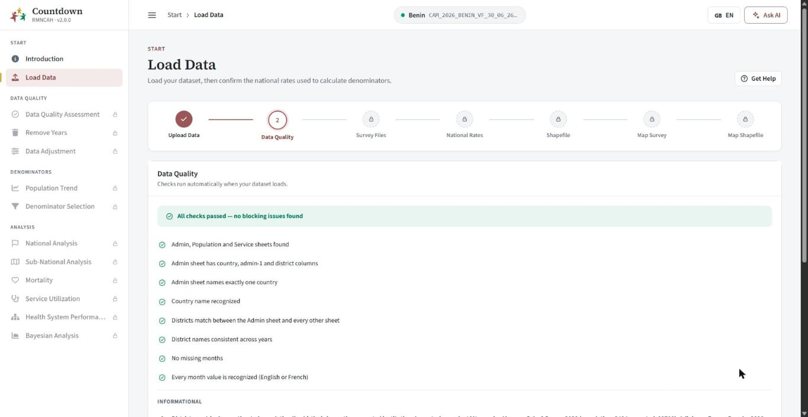

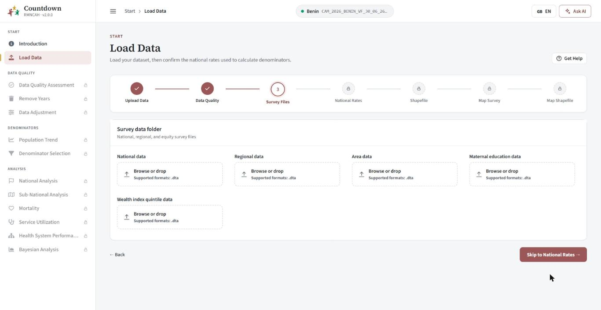

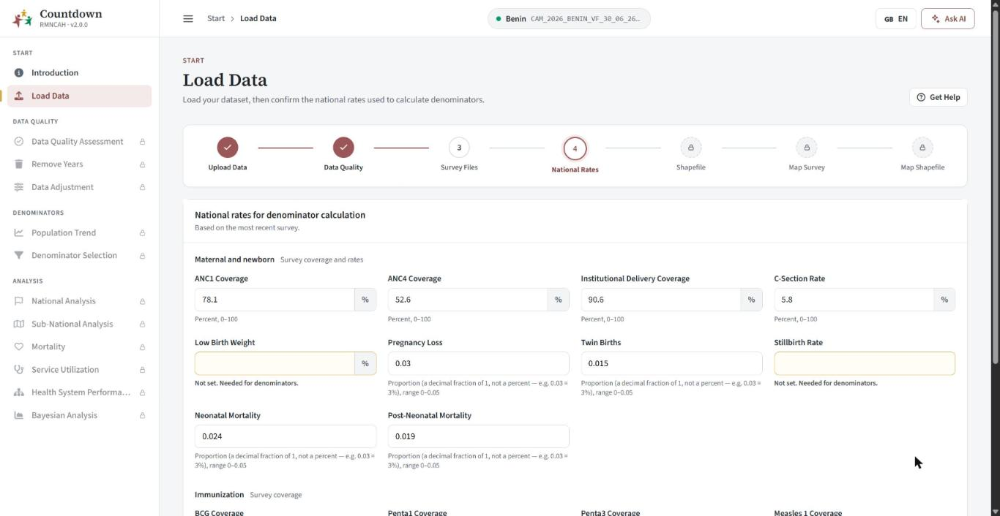

### How it behaves

* **A fresh Excel upload** is kept as separate sheets (`cache$wizard_parts`) and merged only at **Finish**, so every check can say *which sheet* has a problem. `.dta` and `.rds` files load already merged.
* **Locking.** On a fresh walkthrough a step opens only once the step before it has been continued or skipped past (the rail shows the rest with a padlock, and so does the sidebar until Finish). Editing a finished dataset unlocks everything. A step
  shows as complete on the rail only after you have moved past it; the real `complete` state (`compute_step_states()`) is what gates Continue.
* **Resume.** Uploading `Benin.xlsx` again loads that app's saved copy `Benin_<group>.rds` (`cd_saved_copy_name()`) if there is one, skipping the walkthrough; a saved copy that cannot be read is ignored and the original is loaded.
* **The group.** The dataset must be for this app's indicator group (`cd_wizard_check_group()`); another group's `.rds` is refused with a message.
* **Finish** merges and standardises the sheets (`merge_and_standardize()`), adds the synthetic admin-1 keys, writes `<file>_<group>.rds` and lands on a summary page (below).


### The pieces


| Function | Purpose |
| --- | --- |
| `wizard_steps_ui(id)` / `wizard_steps_server(id, i18n, cache, requires_walkthrough, panels, source_path, active, step_defs)` | the rail, the panels, the footer (Back / Skip / Continue / Finish), the landing summary and the Finish sequence. `panels` is `list(list(key =, ui =), ...)` in step order |
| `cd_wizard_steps(inputId, steps, i18n)` | the rail component; `input$<inputId>` is the clicked step key |
| `wizard_step_defs`, `compute_step_states(cd, current, requires_walkthrough, step_defs, acknowledged)`, `step_*_complete(cd)` | the step list and its completion rules; each state has `key`, `status` (what the rail shows), `complete`, `locked`, `required`, `relevant` |
| `wizard_landing_ui/_server` | the summary after Finish, with an Edit link per step |
| `upload_box_ui(id, i18n, is_electron)` / `upload_box_server(id, i18n, cdsuite_file, is_electron)` | dataset upload; returns `cache`, `requires_walkthrough`, `source_path` |
| `nr_field()`, `nr_group()` | one national-rate field and one group of them |
| `mapping_modal_ui/_server`, `mapping_provenance_banner()` | the region-mapping dialog and the banner saying how a mapping was made |

### Per-app configuration

Everything above is identical for every indicator group. An app states only its own part, once, in its `R/page-0_upload_data.R` (its `<app>_wizard_options()`; the file also assembles the panels and defines `upload_data_ui` / `upload_data_server`):

```r
options(cd2030.wizard = list(
  national_rates_groups = list(
    cd_wizard_field_group("title_upload_group_maternal", "sub_upload_group_maternal",
      cd_wizard_survey_field("anc1_prop", "anc1", "title_upload_anc1_survey"),  # input id, name in cache$survey_estimates, label key
      cd_wizard_national_rate_fields()),                                        # nmr, pnmr, sbr, twin_rate, preg_loss
    cd_wizard_field_group("title_upload_group_immunization", "sub_upload_group_immunization",
      cd_wizard_survey_field("penta3_prop", "penta3", "title_upload_penta3_survey"))
  ),
  reference_uploads = c("un_estimates", "wuenic_estimates")     # rmncah also has "un_mortality_estimates"
))
```

`cd_wizard_survey_field(id, key, label_key)` is a percent (0-100); `cd_wizard_rate_field(id, key, label_key)` a proportion (0-0.05); `cd_wizard_field_group(title_key, subtitle_key, ...)` a card of fields
(single fields and/or lists of fields such as `cd_wizard_national_rate_fields()`). **Every listed field is required** before Continue is enabled. `cd_wizard_config()` reads and validates the option;
`cd_wizard_indicator_group()` is the app's group (`options(cd2030.app_group)`).

---

## 10. Shared page modules

**(cd2030.core**, `R/ui-page-*.R`.) Pages that are identical for every indicator group are used by every Countdown app; an app's `R/pages.R` just names them. They read what differs per app with `cd_cfg()`
(see the config table in `README.md`). Each is `<page>_ui(id, i18n)` / `<page>_server(id, cache, i18n, active)`.

| Page (registry id) | Module | Reads from config | Built from |
| --- | --- | --- | --- |
| `reporting_rate` | `reporting_rate` | `reporting_rate_indicators`, `reporting_rate_facet_ncol` | tabbed chart card, table card, national chart card |
| `outlier_detection` | `outlier_detection` | - | indicator + admin filters, tabbed heat maps, tables |
| `data_completeness` | `data_completeness` | - | indicator (with "All") + admin filters, tabs, table |
| `internal_consistency` | `internal_consistency`, `calculate_ratios`, `consistency_check` | `consistency_pairs` | ratio chart, one tab per pair + Custom Check |
| `overall_score` | `overall_score` | - | table, chart |
| `remove_years` | `remove_years` | - | years form |
| `data_adjustment` | `data_adjustment` | `k_factors` | form (one select per factor), message box |
| `data_adjustment_changes` | `adjustment_changes` | `adjustment_indicators`, `k_factors` | `cd_tabbed_charts` |
| `denominator_assessment` | `denominator_assessment` | - | population select, tabbed chart |
| `denominator_selection` | `denominator_selection`, `coverage_trends`, `survey_comparison`, `subnational_denominator` | `cov_trend_indicators`, `survey_comp_indicators`, `sub_derived_indicators`, `has_maternal` | denominator chips + three tabbed cards |
| `national_coverage` (+ sub-national) | `national_coverage`, `coverage` | `nat_cov_indicators` | `cd_scoped_page_*` + `cd_tabbed_charts` |
| `national_target` (+ sub-national) | `national_target`, `target` | `target_indicators` | `cd_scoped_page_*` |
| `national_inequality` | `national_inequality`, `inequality`, `subnational_mapping` | - | `cd_map_options` + two tabbed cards driven together |
| `subnational_inequality` | `subnational_inequality` | - | `cd_scoped_page_*` |
| `equity_assessment` | `equity` | `equity_indicators`, `equity_custom_exclude` | `cd_tabbed_charts` |
| (Introduction, not in the registry) | `introduction` | - | a help markdown per language |

Anything genuinely specific to one group stays in that app's package (`R/page-*.R`: rmncah's mortality, service utilization, health-system and Bayesian pages; each app's `R/page-0_upload_data.R`).


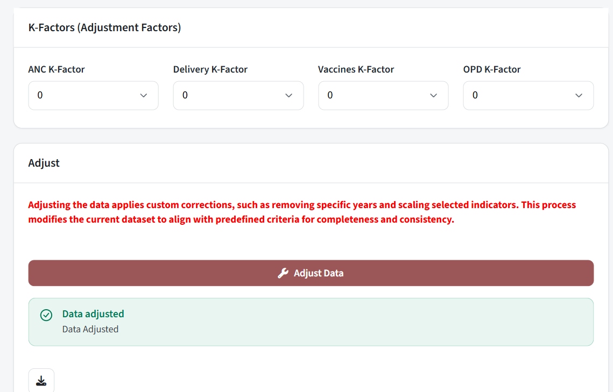

---

## 11. Themes

`app_frame(theme = ...)` puts `cd-theme-<name>` on `<body>`; the last block of `inst/www/cd-ui.css` ("App themes") re-declares five tokens (`--cd-primary`, `--cd-primary-hover`, `--cd-primary-rgb`, `--cd-primary-ink`, `--cd-primary-tint`). Components only use the tokens, so
a new theme is one CSS block. **Never hard-code a brand colour in a component.**

| Theme | `theme =` | Colour | Used by |
| --- | --- | --- | --- |
| default | `"rmncah"` or `NULL` | maroon `#9b5758` | rmncah |
| vaccine | `"vaccine"` | blue `#2f6db5` | vaxx |
| pooled | `"pooled"` | green `#1f8a5f` | pooled |

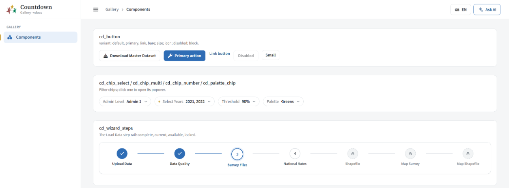
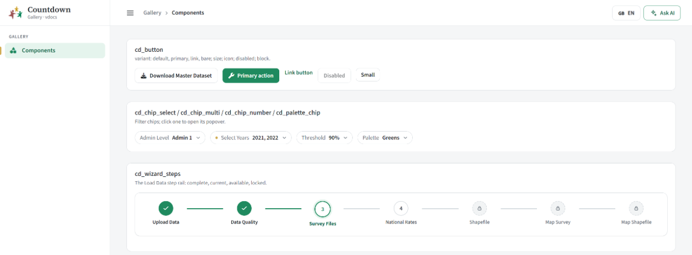

---

## 12. The React side

R function -> React component (`js/src/components/*.tsx`), all registered in `js/src/index.ts` under `window.jsmodule["@/countdown"]` and created from R by `cd_react_element("<Name>", props)`.

| R | React component | Notes |
| --- | --- | --- |
| `cd_button` | `CdButton` | one-shot event via `setInputValue(id, Date.now(), {priority: "event"})` |
| `cd_checkbox`, `cd_text_area` | `CdCheckbox`, `CdTextArea` | |
| `cd_chip_select`, `cd_chip_multi`, `cd_chip_number` | `ChipSelect`, `ChipMulti`, `ChipNumber` | share `ChipFrame`, `OptionList`, `usePopover` |
| `cd_field_number`, `cd_field_select` | `FieldNumber`, `FieldSelect` | send `input$<id>__mounted` |
| `cd_file_upload`, `cd_directory_upload` | `FileUploadZone` | wraps Shiny's native file input (not an `InputAdapter`) |
| `cd_mapping_modal` | `MappingModal` | uses `matching.ts` |
| `cd_status_banner`, `cd_message_box` | `StatusBanner`, `MessageBoxStatus` | share `StatusIcon` |
| `cd_tooltip`, `cd_loading_skeleton`, `cd_empty_state` | `Tooltip`, `LoadingSkeleton`, `EmptyState` | |
| `cd_chart_customize`, `cd_expand_button` | `ChartCustomize`, `ExpandButton` | share `ToolFrame` |
| `cd_card_header` | `CardHeader` | |
| `cd_wizard_steps` | `WizardSteps` | |
| `cd_download_status` | `DownloadButtonStatus` | |
| `cd_shell_server` (sidebar, header) | `Sidebar`, `HeaderBreadcrumb`, `HeaderActions` (in `HeaderBar.tsx`) | |

Scripts that are not components: `lang.ts` (the `cd-lang` message and `useLang()`; every text prop is `{en, fr, pt}` shown with `tr(text, lang)`), `nav.ts` (top-level page switching, sidebar and collapse state, the `cd-navigate` message, a `resize` after each switch so
Shiny re-checks which outputs are visible), `tabswitch.ts` (`cd-tab-switch`, for `cd_update_tab_panes`), `spinner.ts` (the skeleton state machine), `dialog.ts` (closing dialogs), `matching.ts` (region auto-matching), `usePopover.ts`.

Build: `cd js && npm run build` (type-check, then webpack) writes `inst/www/cd-react/cd-react.js`, which is committed. See `HOWTO.md` -> "Add a React component".

---

## 13. Reports page and report builder

`reports_ui()` / `reports_server()` (`R/kit-reports.R`) and React `ReportStudio` (`js/src/components/ReportStudio.tsx`,
`js/src/components/report/`). An app turns it on with one page entry (`id = "reports"`, see rmncah's `R/pages.R`) and a nav item.
What the reports contain -- the kinds of chart and table, the standard reports, extra fields, a theme -- is the app's, given
with `report_register()` (cd2030.core registers Countdown's; see "R side: the report functions" below).
The bullets below describe what the builder does; the [component reference](#where-the-code-is) after them documents every
component, hook and function it is made of, and the R side.

- **Reports home:** the dataset's reports (open, duplicate, delete) and the standard reports (registered as `report_register(presets = )`; Countdown's are `cd2030.core::report_presets(lang, group)`),
  each opened as an editable copy. The standard reports are the Countdown reports of each analysis section, in the order of the analysis
  (data quality, adjustment, denominators, national coverage, inequality, mortality, service utilization, health system, private sector),
  then the **synthesis chartbook** (chartbook page, 13.93 × 22 in) and the **sub-national one-pager** (poster page, 22 × 17 in
  landscape). vaxx has its own list (vaccine versions). Each lives in `cd2030.core/R/report-preset-<id>.R`, written in the three languages.
  The one-pager is about one region: its blocks have `region = "@report"`, filled from the report's region (Layout tab), and `{region}`
  is a field. They replace the old R Markdown templates and `generate_report()`.
- **A new report is named first** (blank or standard): the dialog suggests "<report> – <country> <latest year>".
- **A page's "Generate report" button** (page registry `report = "<standard report id>"`) opens the Reports page with that standard report
  and the naming dialog (`cd_request_report()`); the header's Reports button opens the page. Both appear only in an app with the page.
- **Language:** each report has its own language (`project$lang`), chosen in the naming dialog (the app's language by default). A standard
  report's text is written in it, and its charts, tables, dates and file are always drawn in it (`cd_report_translator()`), whatever the
  app's language. The Layout tab can change it: charts and tables are redrawn, text already written is not translated. A report saved
  before reports had a language follows the app's.
- **Rows:** consecutive half-width charts or pictures share a row two at a time, third-width ones three at a time.
- **Builder:** a ribbon (Home, Insert, Design, Layout, and on a selected chart *Chart Design* and *Format*, on a picture *Picture
  Format*, as Word's contextual tabs) over the pages; blocks and outline on the left (hidden with the top bar's button). There is no
  settings panel: a selected block is set up from the ribbon; the theme and the cover page open as a task pane on the right from the
  ribbon (or a click on the cover). Drag from the palette or reorder on the page by a block's grip; undo/redo; zoom; preview.
- **One document** (`report/flow/`, TipTap 3, MIT packages only; no Pro extension or TipTap account): the whole report is edited as
  in a word processor. Selection, formatting, copy and paste work across paragraphs; nested bulleted and numbered lists (Tab and
  Shift+Tab change the level); headings H1 to H6, quotes and preformatted text (Styles gallery, or typing `## `, `- `, `1. `, `> `);
  undo and redo in chunks, charts and settings included. Charts, tables and pictures are parts inside the text (`rbBlock`,
  `flow/BlockView.tsx`), still drawn by R; pictures can be dropped on the page or pasted. The report is still saved as its blocks
  (`flow/convert.ts`): each block's `text` is a small HTML subset (inline formatting; `<p>`, nested `<ul>/<ol>` in lists, notes and
  quotes; plain text for preformatted blocks), new block types `list`, `quote`, `pre`, headings levels 1 to 6. The export writes
  them to Word (`.rb_lines()` reads list levels, `.rb_docx_fpars()`, Heading 3 to 6 styles). Lists are Word numbering
  (each list its own, 1. a. i. / bullets by level; `.rb_docx_numbering()`), headings keep their formatting, links (Insert > Link) are
  Word hyperlinks. Older reports open unchanged.
- **Pages** (`flow/pages.ts`): the text is laid out by the browser and measured; where a block would cross the bottom of a page, a gap
  is put before it (a decoration, not part of the document) reaching the next sheet; the sheets, header and footer are drawn behind.
  A heading stays with what follows it; a page break starts a new page. A paragraph or a list that does not fit is split
  between two lines (an inline gap), keeping two lines at least on each page as Word's widow and orphan control; so are notes,
  quotes and preformatted text (the gap then covers the box, painted as the page margins and the grey between sheets); charts,
  tables and pictures move whole. As in Word: the text area is the page less its margins, space before and after meet (the
  larger counts), the last block's space after may fall into the bottom margin, and a heading or a short paragraph before a
  chart stays with what follows. Positions are measured without the gaps already in place, so the
  layout settles in one pass. The side-by-side view shows a copy of these pages. Word's own layout is in *Final pages*.
- **Fields:** `{country}`, `{latest_year}`, `{anc4_latest}`... (`report_field_catalog()`: the built-in ones plus those the app registers) typed anywhere, or inserted from
  the ribbon's *Field* menu; shown as shaded chips with their value (`cd-report-fields`), filled in when the file is written.
- **Charts:** *Chart Design* has what the chart shows (indicator, level, region, year), its width, legend, title, gridlines, style and
  colours; *Format* its font, text size, data label size, axis label angles, line width, point size and bar width, as number boxes that
  take any value (or one from the list under their arrow; empty = as drawn). **Customize** (the sliders icon on the selected chart, the
  ribbon button, or a double-click) opens the same pop-up as the Customize tool on the app's charts, next to the
  chart: every chart option (`cd_chart_schema()`), for this chart in this report only (the block's `options`). Legend entries come with
  each preview, so series can be recoloured and renamed.
- **Zoom:** zoom out / in, a slider (25% to 200%), preset sizes, *Page width* and *Whole page*; Ctrl + mouse wheel. When two or more
  pages fit across the window they are laid side by side (Word's multi-page view), so a small zoom never needs sideways scrolling. A page
  wider than the window (poster, chartbook, landscape) opens fitted to the width.
- **Palette order:** the blocks are grouped by analysis step (`report_block_kinds()` sorts them).
- **Pictures** (`report/Picture.tsx`, `.rb_image_file()` in `R/report-export.R`): from this computer, dropped on the page, pasted, or from a
  web address (downloaded by R at once, so the report needs no internet later). Each is kept once in the dataset
  (`cache$set_report_asset()`, `report_store_asset()`; a block's `src` is `"asset:<id>"`; pictures inside older reports move there
  when they open); the Word file and the PDF embed their own copy. Resize by a corner handle (the shape is kept), stretch by a
  side handle (only the width or only the height changes; kept as `stretch`, the height over the height its shape gives,
  `.rb_image_stretch()`), or in cm; crop on the
  picture itself (Crop on the Picture Format tab or in the menu beside it: the whole picture shows dimmed outside the part kept,
  drag the black crop handles or move the frame, Enter or a click elsewhere keeps it, Esc cancels; the picture keeps its scale)
  or to a shape (1:1, 4:3, 3:2, 16:9, 3:4, 2:3); rotate, flip, brightness, contrast, greyscale; square, rounded or circle; border
  colour and width; text wrapping (left or right: a floating table in Word) and the space kept around the picture (above, below,
  beside); caption and alt text. When selected, a menu beside it has the wrapping, alignment, rotation and crop. The editor draws
  them as the file will: geometry on a canvas, colours with CSS filters that do the same arithmetic as the magick levels used for
  the Word file.
- **Charts as pictures:** a chart has the Picture Format tab too (after Chart Design and Format), and the same menu and handles:
  it is shown as a picture of its drawing (`layout.ts` `asPicture()` / `shownInches()`, `.rb_shown_size()` in `R/report-builder.R`): width
  as a percent of its column, crop, turn, flip, colours, shape, border, wrapping and spacing. Unformatted it is written as before
  (SVG with a PNG copy); once cropped, turned, recoloured or shaped (`.rb_chart_pictured()`) it is drawn at 300 dpi and changed by
  `.rb_image_file()` like a picture.
- **Workspace:** undo and redo above the tabs (Word's quick access toolbar), so Clipboard is the Home tab's first group; icons
  coloured by kind; every tooltip gives the shortcut. The style gallery (`StyleGallery`) takes the room the ribbon has left:
  compact cards, as many as fit, arrows to scroll a row and to open the style window (every style as a card, Clear formatting,
  Modify styles); on a narrow ribbon it folds into one Styles button, and then the other groups fold, from the right, into
  one button each that opens the group (`RibbonBody` / `Group`). Selected text gets Word's mini toolbar (font, size,
  grow/shrink, change case, format painter; bold, italic, underline, highlight, colour, bullets, numbering; Styles, Centre,
  Line and Paragraph Spacing, Paragraph), above the selection or under it, fading as the mouse moves away. The format painter
  (also on the Home tab under Copy) copies the formatting where the caret is onto the next text selected; a double click
  keeps it on, Esc stops it. A selected chart, table or picture gets its own toolbar above it (Style, Crop, Border, Wrap
  Text, Rotate, Position, Customize for charts; move, duplicate, delete); only the drag grip stays on the block.
- **Chart titles and fields:** `{chart_indicator}` and `{chart_year}` (Insert > Field > Chart below) show the indicator and
  year of the first chart or table after the text (`report_chart_fields()`; in the editor, `fieldAt()` in
  `flow/extensions.ts`), so a title follows its chart; the standard reports' titles use them. `{chart_indicators}` names
  the indicators of all the charts after the text up to the next heading ("Pentavalent 3 and Measles 1"), for a heading
  above charts side by side. No standard report names an indicator outright above a chart whose indicator can be
  changed. A chart's own title can use
  them too.
- **Panels:** a chart drawn as panels (by year, district, method...) gets a Panels group on Chart Design: panels across and
  down, shared or separate axes, where the panel names go (options `facet_ncol`, `facet_nrow`, `facet_scales`,
  `strip_position`; `chart_facet_info()` tells the editor how a chart is drawn).
- **Blocks panel:** each chart has a small picture of itself drawn with its first settings (`cd_report_thumb()`, once per
  dataset, one per turn after the report's previews); a Custom section waits for charts made for the dataset (later, by
  asking the AI).
- **Cover:** its kicker, title, subtitle and reference are typed on the page (fields show as typed while editing); the
  rest (layout, logos, editors, date) is in its pane.
- **Slide decks** (`report/DeckEditor.tsx`, `report/deck.ts`; R `export_deck()`): a report with `kind = "deck"`
  has `slides`, each with a layout (Title Slide, Title and Content, Two / Three Content, Comparison, Title Only, Section
  Header, Blank: `LAYOUTS`, the same as `report_deck_layouts()`), items anywhere on the slide (`x, y, w, h` in inches; the
  first at the back) and speaker notes. Slides down the left (drag to reorder, duplicate, delete, New Slide), the slide in
  the middle with its notes under it, the same ribbon in deck mode (Home: Slides group; Insert: Text Box; Design: Slide
  Size 16:9 / 4:3; no page setup), views Normal / Slide Sorter / Reading, Slide Show (F5, full screen). A box is moved by
  dragging (guides snap it to the slide's middle and edges and to the other boxes), resized by its handles (a picture's or
  chart's corners keep its shape), nudged with the arrows; a click in a text box types in it (TipTap, with the ribbon's font
  and paragraph commands); an empty content placeholder offers Chart, Table and Picture. Keys: Delete, Ctrl+D / C / X / V,
  Ctrl+M new slide, Page Up / Down, Tab, Esc, Ctrl+Z / Y. Charts are drawn at their box's size (`block.box`, part of the
  signature); the file is PowerPoint (charts as editable drawings) or a PDF made from it. The sub-national one-pager is a
  standard deck: one dense 16:9 slide.
- **Free-layout page** (`flow/CanvasPage.tsx`; R `.rb_canvas_prepare()` / `.rb_docx_canvas()` in `report-canvas.R`): Insert >
  Free page puts a block of type `"canvas"` in a document: a whole page (the text area) of boxes, placed as on a slide. Clicking
  it edits it (its boxes' keys and the ribbon's tabs act on it; Insert's chart, table and picture go on it, and Text Box
  appears); a click in the document's text leaves it. Selected as a block (from the outline or its edge) it is moved,
  duplicated or deleted like any block. Word gets it as floating objects at the same places (text boxes with their
  formatting, charts and pictures as pictures, tables in text boxes) on a page of its own; the PDF is made from it.
- **Region:** a report is national unless a region is picked (Layout > Region has National); only the one-pager, whose
  charts are for one region, starts with one.
- A status bar as Word's: page of the caret, words, characters; the blocks panel; Focus (the pages alone on the
  whole screen: no bar, ribbon, panels or status bar; Esc or the corner button leaves); the views Edit, Read mode (no editing
  marks) and Print layout (the final pages Word makes); a thin zoom slider and the percent with its menu (fit width, whole page).
  Shortcuts: Ctrl+K link, Ctrl+Enter page break, Ctrl+Shift+> / < text size, Ctrl+S save now, with the editor's own (Ctrl+B/I/U,
  Ctrl+Alt+1..6 headings, Ctrl+Alt+0 body text, Ctrl+Shift+7/8 lists, Tab / Shift+Tab levels).
- **Theme** (the app's registered themes -- Countdown, from cd2030.core -- then `report_themes()`: Ministry of Health, Minimal, Formal, then anything changed): fonts (print typefaces
  that come with Office, serif then sans serif, only those installed: `report_fonts()`), colours, a chart palette given to each chart's series, text sizes. The theme becomes the Word file's styles.
- **Cover page:** layouts band / full colour / photo / minimal, line above the title, title, subtitle, the country flag (downloaded once from
  flagcdn.com; left out without internet), logos, editors, date, reference.
- **Page:** A4/Letter, portrait/landscape, margins, header and footer (fields allowed), page numbers, contents page.
- **Blocks are descriptions, not pictures:** a chart block says what to draw (kind, indicator, level, region, year, variant, size, options).
  The component signs each chart block (`sig`, `layout.ts blockSig()`: its settings plus the theme's font, palette and page); R draws a
  block again when its sig changes (`render_report_block()`, message `cd-report-preview`, one per event-loop turn). The kinds are the
  app's (`report_register(kinds = )`; Countdown's are `cd2030.core::report_block_kinds()`): add one there (its drawing code in
  cd2030.core's `.rb_draw()`) plus `lbl_rb_kind_<kind>` in cd2030.core's `cd2030.json`.
- **Saved in the dataset:** every edit is saved with `cache$set_report_project(id, project)`.
- **Word and PDF are the same document:** `export_report()` writes the Word file, then makes the PDF from it with Microsoft
  Word (Windows, through PowerShell) or LibreOffice (`report_converter()`); Word also fills in the contents page and embeds the fonts.
  Two half-width charts or pictures sit in an invisible two-column table with fixed widths, and nothing floats, so Word keeps the layout.
  Without Word or LibreOffice the PDF is printed from HTML (chromote), and the dialog says it may differ.
- **Final pages:** renders the PDF made from the Word file, page by page (`report_final_pages()`, message `cd-report-final`), so what is
  checked is what is sent. The pages in the builder are estimated; these are the real ones.

### Where the code is

| Where | What |
| --- | --- |
| `R/kit-reports.R` | the page module (`reports_ui()` / `reports_server()`): the list of reports, drawing previews, saving, exports |
| `js/src/components/ReportStudio.tsx` | the React input the page shows: the reports home, the naming dialog, and one of the two builders |
| `js/src/components/report/types.ts` | the data model (below) |
| `report/ReportEditor.tsx`, `report/DeckEditor.tsx` | the two builders: documents (Word) and slide decks (PowerPoint) |
| `report/Ribbon.tsx`, `report/ribbon/` | the ribbon, its contextual tabs, its menus and the two toolbars over the page |
| `report/kit/` | the parts every builder is made from (controls, menus, frame, pictures, zoom and pan, undo, the box canvas) |
| `report/flow/` | the document engine: the TipTap nodes, pagination, blocks <-> document, block commands, the chart / picture node view, free pages |
| `report/RichText.tsx` | text formatting commands, the active editor, the format painter |
| `report/Picture.tsx`, `report/panels.tsx`, `report/dialogs.tsx`, `report/CoverText.tsx`, `report/ui.tsx` | a picture on the page; the task panes; the dialogs; a cover text; icons and small pieces |
| `report/layout.ts`, `report/deck.ts` | page and block geometry, signatures, text helpers; slides and their layouts |
| `R/report-*.R` | the engine: blocks, themes, fields, Word / PowerPoint / PDF export, Office templates |
| cd2030.core `R/report-countdown.R`, `R/report-preset-*.R` | Countdown's content: its kinds of chart and table and their drawing code, its standard reports, fields and theme |

Every React text is a key of `texts` (the `lbl_rb_*` translations without their prefix, `cd_report_texts()`), shown with
`t(k) = tr(texts[k], lang) || k`: a missing key shows as itself.

### Data model (`report/types.ts`)

A **report** (`RbProject`) is a design, a cover and either **blocks** (a document) or **slides** (a deck). Charts and tables
are *descriptions* (what to draw); R draws them and sends a preview back. The same fields are documented in
`R/report-builder.R` and `R/report-theme.R`.

| Type | Fields |
| --- | --- |
| `RbProject` | `id`, `name`, `design: RbDesign`, `cover: RbCover`, `region?` (the region `"@report"` blocks use; none = national), `lang?` (`"en"` / `"fr"` / `"pt"`; none = the app's, older reports), `blocks: RbBlock[]`, `kind?: "document" \| "deck"` (none = document), `slides?: RbSlide[]` (a deck's) |
| `RbSlide` | `id`, `layout: SlideLayout`, `items: RbSlideItem[]` (the first at the back), `notes?` (speaker notes) |
| `RbSlideItem` | `id`, `x`, `y`, `w`, `h` (inches from the top-left), `role?: "title" \| "subtitle" \| "heading" \| "body" \| "picture"`, `block: RbBlock` |
| `SlideLayout` | `"title" \| "title_content" \| "two_content" \| "three_content" \| "comparison" \| "title_only" \| "section" \| "blank" \| "picture_caption" \| "content_caption" \| "picture_left" \| "full_picture"` |
| `RbCover` | `layout: "band" \| "full" \| "photo" \| "minimal"`, `kicker`, `title`, `subtitle`, `show_flag`, `logos: {src, name?}[]`, `photo?`, `editors: RbEditor[]` (`{name, role?}`), `date_mode: "month" \| "today" \| "custom"`, `date`, `reference` |
| `RbTheme` | an `RbDesign` plus `name: LocalText`: a built-in theme (`report_themes()`) or one made from an Office file |

**`RbBlock`**: `type: BlockType` is `heading`, `paragraph`, `list`, `note`, `quote`, `pre`, `pagebreak`, `chart`, `table`,
`image` or `canvas`; every block has an `id`.

| For | Fields |
| --- | --- |
| text | `text` (heading: plain; paragraph and note: a small HTML subset; list: nested `<ul>/<ol>`; quote: `<p>`s; pre: plain), `level` (headings 1 to 6), `align` (`left` / `center` / `right` / `justify`), `list` (`"bullet"` / `"number"`; older reports: a paragraph shown as a list) |
| paragraph settings (over the theme's) | `indent_left`, `indent_right` (cm), `space_before`, `space_after` (pt), `line` (1 = single) |
| charts and tables | `kind`, `indicator`, `admin_level`, `region` (`"@report"` = the report's), `year`, `variant`, `size` (`"full"` / `"half"` / `"third"`), `title`, `caption` (`false` hides a chart's caption; a picture's caption text), `options` (its Customize values, this chart only), `sig` (its signature: R redraws it when it changes), `box` (a chart on a slide or a free page: the size it is drawn at, inches) |
| pictures (and charts shown as pictures) | `src` (`"asset:<id>"`; older reports a data URL), `ratio` (height / width), `width` (percent of its column, 5 to 100), `shape` (`rect` / `rounded` / `circle`), `border`, `border_color`, `border_width` (pt), `alt`, `space_top`, `space_bottom`, `space_side` (pt), `wrap` (`inline` / `left` / `right`; full width only), `rotate` (0 / 90 / 180 / 270), `flip_h`, `flip_v`, `crop` (percent cut off top, right, bottom, left), `stretch` (height over the height its shape gives), `brightness`, `contrast` (-100 to 100), `greyscale`, `pic_style` (`shadow` / `frame` / `soft` / `reflection`) |
| text boxes (slides, free pages) | `font_size` (pt), `color`, `valign` (`top` / `middle` / `bottom`), `fill`, `fill_opacity` (0 to 1), `outline` |
| a free page (`canvas`) | `items: RbSlideItem[]` (inches from the top-left of the text area), `h` (its height; none = the text area) |

**`RbDesign`** (the theme and the page): colours `accent`, `heading_color`, `text_color`, `muted_color`, `note_fill`,
`note_border`; fonts `heading_font`, `body_font`; sizes in pt `title_size`, `h1_size`, `h2_size`, `body_size`, `note_size`,
`caption_size`; `line_spacing`, `paragraph_after` (pt); `palette` (the chart colours) and `apply_palette`; the page `size`
(`a4` / `letter` / `a3` / `chartbook` / `poster`), `orientation`, `margins` (`normal` / `narrow` / `wide`), `cover`,
`contents`, `page_numbers`, `header`, `footer` (fields allowed); a deck's `slide_size` (`"16:9"`, 13.33 × 7.5 in, or
`"4:3"`, 10 × 7.5 in). **Template fields**, for a theme made from an Office file: `template` (the file, `"asset:<id>"`),
`template_kind` (`"pptx"` / `"docx"`), `template_ext`, and `background` (a slide's background colour). The Word or
PowerPoint file is then written on top of that file (its masters, styles and logos come with it).
`slide_designs` (`{ title, content }`, `RbSlideDesign`): the look a PowerPoint file puts **on its slides** (many decks,
Google Slides exports especially, have a plain master): a background, `decor` (logos as data-URI pictures, bands) and
the `title` / `subtitle` / `body` text styles and boxes. A slide uses `title` for the title and section layouts and
`content` otherwise (`slide.design` overrides). `BoxCanvas` draws the decor behind the items, `designedBlock()` styles a
text item by its role where the item sets nothing itself, and new slides place their title (and body) where the file does;
the export does the same (`.rb_designed_item()`, `.rb_deck_design()` in `R/report-deck.R`).

What R sends back and the builder's other types:

| Type | Fields |
| --- | --- |
| `RbPreview` | `sig`, `src?` (a picture), `html?` (a table), `error?`, `w`, `h` (inches), `entries?` (legend entries and categories, to recolour or rename), `facets?: RbFacets` |
| `RbFacets` | `type: "wrap" \| "grid"`, `ncol`, `nrow`, `scales`, `strip_position`, `panels` (`chart_facet_info()`) |
| `RbKind` | a kind of block for the palette and Chart Design: `kind`, `type`, `group`, `groupLabel`, `label`, `indicators?`, `levels?`, `variants?` (`RbOption {value, label}`), `year?`, `regional?`, `tall?`, `defaults` |
| `RbSummary`, `RbPreset` | a row of the home list (`id`, `name`, `kind?`, `updated`, `charts`, `blocks`); a standard report (`id`, `name`, `description`, `kind?`, `charts`) |
| `RbField` | `key`, `group`, `label` |
| `RbChartSchema` | the Customize panel's `tabs`, `fields`, `texts` |
| `RbExportState` | `status: "running" \| "done" \| "error"`, `format` (`docx` / `pdf` / `pptx`), `pct?`, `stage?`, `message?`, `url?`, `fileName?`, `madeBy?` (`"word"`, `"libreoffice"`, `"browser"` or nothing) |
| `RbFinalState` | `status`, `pct?`, `pages?` (data URLs), `converter?`, `message?`, `noConverter?` |
| `Texts` | `Record<string, LocalText>` |

`DEFAULT_DESIGN` / `DEFAULT_COVER` are the Countdown theme and a band cover; `fullDesign(d)` / `fullCover(c)` fill in what a
saved report lacks (and read designs saved before themes, which had `font = "serif"` / `"sans"`).

### `ReportStudio`

`js/src/components/ReportStudio.tsx`, created by `cd_report_studio(inputId, i18n)`, which `reports_ui()` puts on the page.
An `InputAdapter`: its **value is the open report** (`input$<id>`, an `RbProject` or `NULL`) and every edit sets it.
Buttons that ask R to do something are one-shot events on **`input$<id>__action`** (`{type, ..., nonce}`; see
[the actions](#r-side-module-messages-actions)). It also sends `input$<id>__mounted`.

| Prop | Meaning |
| --- | --- |
| `value` | the report open, or `null` (the home) |
| `projects: RbSummary[]`, `presets: RbPreset[]` | the dataset's reports and the standard reports |
| `kinds`, `regions`, `years` | the kinds of block (`cd_report_kinds()`), the admin-1 regions, the data years |
| `themes`, `fonts` | `report_themes()` then the dataset's Office themes; `report_fonts()` |
| `fieldCatalog` | the fields that can be inserted (`cd_report_field_catalog()`) |
| `flag`, `converter` | the country's flag (a data URL); `report_converter()` (`"word"`, `"libreoffice"` or `null`) |
| `layouts` | the slide layouts (`report_deck_layouts()`), given to `setLayouts()` |
| `chartSchema` | the Customize panel's tabs, fields and texts (`cd_chart_schema()`) |
| `suggest` | `{country, year}`, what a new report's suggested name is made from |
| `request` | `{preset, nonce}`: a page asked for a standard report (`cd_request_report()`); a new nonce opens the naming dialog for it |
| `texts` | the `lbl_rb_*` texts |

It shows the **home** (New document, New slides, the standard reports and standard decks as cards, and "Your reports" with
Open, Duplicate and Delete, which asks first), the **naming dialog** (`NameDialog`) before anything is created, and the open
report in **`DeckEditor`** when `value.kind === "deck"`, else **`ReportEditor`**. It keeps what R sends by message (previews,
fields, pictures, thumbnails, the export and final pages' state, a theme made from a file) and passes it to the builder.
Each render it gives R's tall kinds to `setTallKinds()` and the layouts to `setLayouts()`.

### `ReportEditor`

`report/ReportEditor.tsx`: the document builder. The top bar (`EditorTopBar`), the `Ribbon`, the blocks palette and outline
on the left (hidden with the status bar's button; remembered in `localStorage` as `cd-rb-left`), the pages (one TipTap
document, [flow/](#the-document-engine-flow)), the theme or cover task pane on the right, and the status bar (the caret's
page, words, characters, Focus, the views Edit / Read / Print layout, the hand, the zoom).

| Prop | Meaning |
| --- | --- |
| `project` | the report (normalised: `fullDesign`, `fullCover`, its blocks signed) |
| `kinds`, `regions`, `years`, `themes`, `fonts`, `fieldCatalog` | as `ReportStudio`'s |
| `fields` | the fields' values (`cd-report-fields`) |
| `previews`, `assets`, `thumbs?` | R's drawings by block id, the pictures by asset id, a small picture per kind of chart |
| `assetDone`, `assetFailed`, `onAsset(id, src)`, `onAssetUrl(id, url)` | the picture store's round trip with R (`usePictureStore`) |
| `flag?`, `converter?`, `chartSchema` | as above |
| `exportState`, `finalState`, `saving` | the download dialog's state, the final pages' state, "saving" |
| `onChange(p)`, `onClose()` | an edit; back to the list |
| `onExport(format: "docx" \| "pdf")`, `onExportClosed()`, `onFinal()`, `onFinalClosed()` | ask R for the file or the final pages |
| `onThemeFile?(file)`, `themeArrived?` | a theme from an Office file, and the theme R made (`{theme?, failed?, nonce}`), applied when it arrives |

How it works:

* The document is saved as blocks (`docToBlocks`) 250 ms after typing stops, or at once (Ctrl+S, before an export or the
  final pages). What is not text (theme, cover, name, region, language) goes through `useReportProject` and its undo; the
  text has the editor's own history, and the ribbon's Undo tries the editor first. Ctrl+Z / Y / Shift+Z outside the text
  undo the rest.
* Opening a report sends it straight back, which is what makes R draw its charts; pictures still inside older reports move
  to the dataset then. A new empty report puts the caret on the page.
* A free page being edited (`canvasFor`) takes over what the ribbon acts on: its selected box, or its text box being typed
  in.
* When two pages fit across, they are laid side by side (a read-only copy of the laid-out text; a click goes to that page);
  a page wider than the window opens fitted to the width.
* The cover is drawn on the first page; its kicker, title, subtitle and reference are `CoverText`s.

#### `CoverText`

`report/CoverText.tsx`. A text of the cover typed on the page: it shows `shown` (its fields filled in) and switches to
`value` (with `{fields}`) while it has the focus. Enter or a click elsewhere keeps it (`onChange` is called only when it
changed); Esc puts it back; with `multiline`, Shift+Enter is a new line. An empty one shows `placeholder`
(`cd-rb-covertext--empty`).

```tsx
<CoverText className="cd-rb-cover__title" value={cover.title} shown={fillFields(cover.title, fields)}
  placeholder={t("coverAddTitle")} editable={!preview} multiline onChange={(v) => setCover({ title: v })} />
```

Props: `value`, `shown`, `placeholder`, `editable`, `multiline?`, `className`, `style?`, `onChange(value)`.

### `DeckEditor`

`report/DeckEditor.tsx`: the slide deck builder (PowerPoint's). Slides down the left (drag to reorder, duplicate, delete, New
Slide), the slide in the middle (`BoxCanvas` with `useBoxEditing`) with its notes under it, the same `Ribbon` with `deck`
commands, views Normal / Slide Sorter / Reading, and the slide show (F5 from the start, Shift+F5 from this slide; full
screen; a click, the arrows, space or Enter go on, Esc stops). Its props are `ReportEditor`'s without `thumbs`, `flag` and
`assetFailed`, with `onExport(format: "pptx" | "pdf")`.

* A deck opens with one Title slide if it has none, 16:9 unless it says otherwise; it is signed with `signDeck()`.
* New items go in the middle of the slide, or into the empty placeholder they fill (a picture placeholder crops the picture
  to its box, `fillCrop()`); an empty body placeholder offers Chart, Table and Picture.
* Keys, besides `useBoxEditing`'s: Ctrl+M a new slide (the same layout; after a title slide, Title and Content), F5,
  Ctrl+Z / Y, Page Up / Down (and the arrows when nothing is selected).
* Pictures dropped on the slide go where they are dropped, pasted ones in the middle; a picture from a web address is added
  when R has it.
* The slide stays fitted to the space it has until it is zoomed by hand; Ctrl + wheel zooms; the hand pans.
* A new slide size keeps each box's place relative to the slide's width; a theme from a PowerPoint file brings its slide
  size.
* What is typed in a text box is one undo step (`snapshot()` when typing starts).

### The builder kit (`js/src/components/report/kit/`)

The two builders (documents, slide decks) and the free-layout page are made from these parts; a new custom page or tool
(an infographic editor, a dashboard page, a poster) is made from them too.

| File | Exports | Used by |
|---|---|---|
| `controls.tsx` | `Big`, `Small`, `Group`, `RibbonBody`, `Col`, `Row`, `Drop`, `Item`, `NumCombo`, `SplitSmall`, `StyleGallery`, `LayoutThumb`, `keep`, `tip` (and, used inside it, `TONES`, `toneOf`, `FoldContext`, `FOLDED_WIDTH`, `GROUP_ICON`) | the ribbon, its tabs, both toolbars, `menus.tsx` |
| `menus.tsx` | `SHAPES`, `WrapMenu`, `RotateMenu`, `PicStyleGallery`, `SwatchGrid`, `OPACITIES` (and `wrapOf`, `wrapPatch`, `rotatePatch`, `PIC_STYLES`) | Picture Format, the object toolbar, the ribbon's colour menus |
| `frame.tsx` | `EditorTopBar`, `HandButton`, `ZoomControl` | both builders |
| `pictures.ts` | `usePictureStore`, `themeDesign`, `themeColours` | both builders, the ribbon |
| `place.ts` | `placeAbove`, `placeBeside` | the two toolbars, `ChartStylePop` |
| `usePan.ts` | `usePan` | both builders |
| `useReportProject.ts` | `useReportProject`, `ReportProject` | both builders |
| `ChartStylePop.tsx` | `ChartStylePop` | both builders |
| `BoxCanvas.tsx` | `BoxCanvas`, `BoxCanvasProps`, `useBoxEditing`, `canvasFields`, `Box` (and `BoxTextEditor`, `TableFit`, `textStyle`, `hexAlpha`, `boxTextExtensions`) | slides, free pages |

Every button acts **on mouse down without taking the focus** (`onMouseDown={keep}`), so the text being edited keeps its
selection; menus let their own inputs take the focus. `t` is always `(k: string) => string`.

#### `Big`, `Small`, `Col`, `Row`, `tip`, `keep`

* `Big({icon, label, onClick?, menu?, disabled?, on?, tone?, keys?})` - a large button: an icon over its label, and an arrow
  under it with `menu`. `on` shows it pressed (`aria-pressed`).
* `Small({icon?, label, onClick?, on?, disabled?, wide?, children?, keys?, tone?})` - an icon, with its label beside it when
  `wide`.
* `tone` colours the icon (`amber`, `blue`, `red`, `purple`, `green`, `teal`: class `cd-rb-tone--<tone>`); without one it is
  the icon's own tone from `TONES`, which is keyed by the `ICONS` array itself. `keys` is the shortcut, shown in the tooltip
  (`tip(label, keys)` gives `"Bold (Ctrl+B)"`); the ribbon only shows shortcuts, the editors handle the keys.
* `Col` / `Row` stack small buttons in a column / a row.

#### `RibbonBody` and `Group`

`RibbonBody({tab, label, children})` holds a tab's groups. `Group({label, children, launch?, launchLabel?, fill?, icon?})` is
one group with its name under it; `launch` is the corner arrow that opens its full settings. **Folding:** when the ribbon
is too narrow, groups fold into one button each (`icon`, or three lines), **from the right**, each opening its group as a
menu. Widths are remembered per tab and group label; a `fill` group (the style gallery) counts as 90 px and never folds. It
measures again when the ribbon is resized.

#### `Drop` and `Item`

`Drop({trigger: (open, toggle) => node, children: (close) => node, width?})` - a button that opens a menu under it, moved
left to stay inside the window; a click elsewhere or Esc closes it. `Item({label, hint?, on?, onClick, icon?, style?})` is a
menu item (`role="menuitemradio"`; `on` checks it).

```tsx
<Drop width={200} trigger={(open, toggle) => <Big icon={ICONS.margins} label={t("margins")} menu on={open} onClick={toggle} />}>
  {(close) => <Item label={t("marginWide")} on={design.margins === "wide"} onClick={() => { onDesign({ margins: "wide" }); close(); }} />}
</Drop>
```

#### `NumCombo`

Word's font size box. Any number can be typed: Enter applies it, and so does leaving the box unless `applyOnBlur={false}`;
an empty box means "as drawn" (`undefined`). The arrow keys step it by `step` from the value (from `neutral` when it is
empty); Esc drops what was typed; the arrow beside it lists `presets` (`[value | undefined, label][]`, `undefined` = as
drawn). Values are kept within `min`..`max` and rounded to 2 decimals.

Props: `icon?`, `label`, `hideLabel?`, `unit?`, `value`, `placeholder?`, `min`, `max`, `step`, `neutral`, `presets`,
`disabled?`, `width?` (40), `applyOnBlur?` (true), `onFocus?`, `onChange(v | undefined)`.

```tsx
<NumCombo icon={ICONS.fontGrow} label={t("textSize")} unit="%" value={pct("text_scale")} placeholder="100" min={30} max={400}
  step={5} neutral={100} presets={[[undefined, t("asDrawn")], [125, "125 %"]]} onChange={setPct("text_scale")} />
```

#### `SplitSmall`, `StyleGallery`, `LayoutThumb`

* `SplitSmall({icon, label, onClick, swatch?, children})` - a small button that does the last choice again, with an arrow
  beside it for the choices; `swatch` draws a colour bar under the icon (highlight, text colour).
* `StyleGallery({count, card: (i) => node, win: (close) => node, disabled, t})` - Word's style gallery: as many cards (70 px)
  as fit, arrows to scroll a row and to open `win` (every style); narrower than two cards it is one Styles button.
* `LayoutThumb({items, wide})` - a slide layout drawn small: its placeholders, the title ones darker.

#### `WrapMenu`, `RotateMenu`, `PicStyleGallery`, `SwatchGrid`, `SHAPES`, `OPACITIES`

`kit/menus.tsx`: menus for a picture or chart that appear in more than one place.

* `WrapMenu({b, t, tone?, width?, onSelected})` - In line with text / Left / Right. Text wraps only beside a full-width block,
  so a wrap makes it full width at 45% of its column (unless it is 70% or less already).
* `RotateMenu({b, t, tone?, width?, onSelected})` - rotate right or left by a quarter turn, flip vertical or horizontal (no
  turn and no flip are stored as `undefined`).
* `PicStyleGallery({now?, t, onPick})` - none, shadow, frame, soft edges, reflection (`pic_style`; none = `undefined`).
* `SwatchGrid({colours, onPick, titled?})` - a grid of colour squares.
* `SHAPES` - `[shape, label key, icon]` for `rect`, `rounded` and `circle`. `OPACITIES` - a text box fill's opacity and the
  transparency it shows as: `[1, "0%"]`, `[0.75, "25%"]`, `[0.55, "45%"]`, `[0.35, "65%"]`.

#### `EditorTopBar`, `HandButton`, `ZoomControl`

* `EditorTopBar({name, onName, summary, t, onClose, onDownload, children?})` - the bar above the ribbon: back to all reports,
  the name (editable), `summary` ("Document · 5 pages · Saved"), `children` (e.g. Slide Show), Download.
* `HandButton({on, onToggle, t})` - the Hand tool (see `usePan`).
* `ZoomControl({zoom, onZoom, min? = 0.25, max? = 2, fits, t})` - zoom out, a thin slider, zoom in, and the percent, which
  lists the steps (25% to 400%, within `min`..`max`) and `fits` (`[label, action][]`: page width, whole page, fit slide).

#### `usePictureStore`, `themeDesign`, `themeColours`

`usePictureStore({onAsset, onAssetUrl, assetDone, assetFailed?})` returns `{assetOf, fromUrl}`. Pictures are kept once in the
dataset, never inside the report. `assetOf(src)` gives a data URL a new id, sends it to R (`onAsset`) and returns
`"asset:<id>"` at once. `fromUrl(url, done(src, ratio), fail?(message))` asks R to download it (`onAssetUrl`) and calls
`done("asset:<id>", ratio)` when `assetDone` names it, or `fail` on `assetFailed`. A builder passes its own props:
`usePictureStore(props)`.

`themeDesign(th)` is a theme's look as design settings (colours, fonts, sizes, palette, and the template fields, which a
built-in theme clears); `themeColours(th)` is its colours and palette only.

#### `placeAbove`, `placeBeside`

* `placeAbove(r, w, h, gap = 10, minTop = 8)` - `{top, left}` above the rect `r`, centred on it; under it when there is no
  room above `minTop`; inside the window.
* `placeBeside(r, w, minTop = 70, tall = 320)` - `{top, left, maxHeight}` to the right of `r` (to its left when there is no
  room), from its top, inside the window.

#### `usePan`

`usePan(ref, hand)` returns `{on, dragging, className}`. Dragging the element `ref` scrolls it while the Hand tool is on,
while Space is held (not while typing) or with the middle mouse button (whose browser auto-scroll is stopped). Put
`className` on the element: it gives the hand cursor.

#### `useReportProject`

`useReportProject(initial, sign, onChange)` returns a `ReportProject`: the report being edited, its saving, and undo / redo
for what is not typed.

| Field | Meaning |
| --- | --- |
| `project`, `ref` | the report; `ref.current` is the report now (for callbacks made earlier) |
| `set(p)` | show it without saving it or making an undo step |
| `send(p, now?)` | save it 400 ms later (or `now`); **never twice the same**, because Shiny drops a value equal to the last one, so it would never be confirmed as saved |
| `commit(make, history = true)` | `sign(make(current))`, shown, saved, and with `history` one undo step |
| `snapshot()` | make the report as it is now an undo step (before a change made bit by bit, e.g. typing) |
| `undo()`, `redo()`, `canUndo`, `canRedo` | up to 100 steps; an undo or redo is saved at once |
| `open(p)` | a report just opened: shown, no history, and sent back at once (R draws its charts from what it is sent) |

#### `ChartStylePop`

`ChartStylePop({anchorId, deps, onClose, children})` - the chart Customize pop-up (with `ChartStyle` inside), beside the
element `anchorId` (`"rb-<block id>"`), fixed to the window so the pages' zoom does not move it. It is placed again on
resize, on scroll and when `deps` change; Esc or a click elsewhere (not on the chart) closes it.

#### `BoxCanvas` and `useBoxEditing`

A canvas of boxes: a slide, or a free page of a document. `BoxCanvas` draws it (for editing, thumbnails, the slide show);
`useBoxEditing` selects, moves, resizes and types in its boxes.

`BoxCanvas` props (`BoxCanvasProps`): `slide: {items}`, `size?` (inches; default the deck's slide), `look?` (`"slide"`: white
with a shadow and the design's `background`; `"page"`: inside a page of a document), `design`, `fields`, `previews`,
`assets`, `t`, `interactive?` (editing; thumbnails and the slide show are not), `selected?`, `editing?`, `editAt?` (where the
caret goes), `live?` (boxes being dragged), `cropFor?`, `zoom?`, `guides?`, and the callbacks `onItemDown`, `onHandleDown`,
`onText(item, html)`, `onEditor(editor)`, `onFill(item, "chart" | "table" | "picture", img?)`, `onCrop(item, crop)`,
`onCropDone`.

* Text boxes are styled by `textStyle()`: the theme's fonts and colours by role, their own size, colour, fill, outline and
  alignment. An empty placeholder says what to click. A text box being typed in is a small TipTap editor (`BoxTextEditor`),
  pushed on the [active-editor stack](#the-active-editor-stack) so the ribbon's text commands act on it.
* Pictures and charts are `Picture`s; tables are R's HTML shrunk to fit (`TableFit`).
* An interactive item has the element id `rb-<id>`, by which the object toolbar and the Customize pop-up find it.

`useBoxEditing({items, size, zoom, active, onBox(id, box), onRemove(id), onDuplicate(id), onPaste(items), cropFor?,
setCropFor?})` returns `{selected, setSelected, editing, setEditing, editAt, setEditAt, live, guides, onItemDown,
onHandleDown, clear}`.

* A drag starts after 4 px. A move snaps (within 7 screen px) to the canvas's edges and middle and to the other boxes'
  edges and middles, showing the guide; a resize keeps a picture's or chart's shape at a corner (0.2 in at least); a click
  on a text box types in it.
* Keys, when `active`: Esc (stop typing, then deselect), Delete / Backspace, the arrows (0.1 in; Shift 0.5; Ctrl 0.01),
  Ctrl+D, Ctrl+C / X / V (one clipboard for every canvas), Tab / Shift+Tab (the next box), Enter (type in a text box).

`canvasFields(items, fields, kinds, years, lang, and)` - the report's fields plus `{chart_indicator}` / `{chart_year}` of the first
chart or table on the canvas, and `{chart_indicators}` of all of them.

A custom page made from them needs: the items (`RbSlideItem[]`: `x, y, w, h` in inches and a block), the previews R draws
for their charts and tables (`cd-report-preview`, keyed by item id; R finds them with `report_project_blocks()`), and what
to do when a box changes. For example:

```tsx
const boxes = useBoxEditing({ items, size: [W, H], zoom, active: true, onBox: (id, box) => save(move(items, id, box)),
  onRemove, onDuplicate, onPaste });
<BoxCanvas slide={{ items }} size={[W, H]} design={design} fields={fields} previews={previews} assets={assets} t={t}
  interactive selected={boxes.selected} editing={boxes.editing} editAt={boxes.editAt} live={boxes.live} guides={boxes.guides}
  zoom={zoom} onItemDown={boxes.onItemDown} onHandleDown={boxes.onHandleDown} onText={(it, html) => save(retext(items, it.id, html))} />
```

### Ribbon and its tabs

#### `Ribbon`

`report/Ribbon.tsx`, used by both builders: tabs **Home, Insert, Design, Layout**, with undo and redo above them, and the
**contextual tabs** of what is selected on the page. A chart gets *Chart Design*, *Format* and *Picture Format*; a table
*Table Design*; a picture *Picture Format*; a free page none. They open when it is selected and go when it is not. It also
renders the two [toolbars](#toolbars) over the page.

| Prop | Meaning |
| --- | --- |
| `design`, `themes`, `fonts`, `kinds`, `fieldCatalog`, `fields`, `texts` | what it offers |
| `current`, `styleNow`, `listNow` | the text block the caret is in, its style (`StyleKind`), its list |
| `canUndo`, `canRedo`, `onUndo`, `onRedo` | the undo and redo above the tabs |
| `onStyle(s)`, `onList(kind)`, `onIndent(dir)`, `onBlock(patch)` | text commands the editor carries out: a style; a list; a list level or indent; the current block's alignment, spacing and indents |
| `onInsert(block)`, `onInsertUrl(url)`, `onOpenBlocks()` | Insert: a block after the caret; a picture from a web address; the blocks panel |
| `onDesign(patch)`, `onTheme(th)`, `onPanel("theme" \| "cover")`, `onThemeFile?(file)` | Design; a theme from an Office file (the file input appears only with it) |
| `regions`, `region`, `onRegion`, `reportLang`, `onReportLang` | Layout > Report |
| `selected`, `selectedKind`, `entries`, `facets`, `years` | the selected chart, table or picture, its kind, its legend entries, its panels |
| `onSelected(patch)`, `onCustomize()`, `cropping`, `onCropMode()`, `onMove(delta)`, `onDuplicate()`, `onRemove()` | what the contextual tabs and the object toolbar do to it |
| `onTextBox?()` | a free page is being edited: Insert > Text Box puts a text box on it |
| `textBox?` | a text box selected on a slide or free page: `{id, fill?, fill_opacity?, outline?, onPatch}` |
| `deck?: DeckCommands` | a deck is being edited (PowerPoint's ribbon) |

**`DeckCommands`**: `layouts` (`{id, label, items}[]`), `layout` (the slide's), `onNewSlide(layout)`, `onLayout(layout)`,
`onResetSlide()`, `onDuplicateSlide()`, `onDeleteSlide()`, `onTextBox()`, `slideSize`, `onSlideSize(size)`.
(`onDeleteSlide` is in the interface but no ribbon button calls it: slides are deleted from the slide list.)

Also exported: `StyleKind` (`"body"`, `"h1"` to `"h6"`, `"note"`, `"quote"`, `"code"`), `LANGS` (the report languages, each
written in itself; the naming dialog uses it) and `FieldMenu` (re-exported from `ribbon/FieldMenu`).

| Tab | Groups (a document) |
| --- | --- |
| Home | Clipboard (Paste, Cut, Copy, Format Painter) · Font (font, size, grow, shrink, change case, clear; bold, italic, underline, strikethrough, subscript, superscript, highlight, colour) · Paragraph (bullets, numbering, indents, alignment, line spacing; its arrow opens Layout) · Styles (the gallery; its arrow opens the theme pane) · Field |
| Insert | Pages (Cover Page, Blank Page, Page Break, Free page) · Tables · Illustrations (Picture, Chart, Blocks) · Text (Note, or Text Box on a free page; Heading, Paragraph, Date) · Links · Header & Footer (header, footer, page numbers) · Quick Parts (the Field menu) |
| Design | Theme (the themes, Customise, Theme from a file) · Document Formatting (theme cards, Colours, Fonts, Paragraph Spacing) · Page Background (Edit cover; cover page and contents on / off) |
| Layout | Page Setup (Margins, Orientation, Size, Page break, Page numbers) · Paragraph (indents in cm, spacing in pt) · Report (the report's language and region) |

**Deck mode** (`deck` set): Home and Insert get a Slides group (New Slide with the layout gallery, Layout, Reset,
Duplicate); the Styles gallery, Pages, Blocks, Heading / Paragraph / Date, Header & Footer, Page Background, Page Setup and
Layout's Paragraph are hidden; Insert > Text is Text Box; Design gets Slide Size (16:9 / 4:3). On a slide or a free page,
Chart Design has no widths, Picture Format has no Arrange, spacing or size boxes, and the object toolbar's up and down are
the stacking order.

Text that can be formatted is a paragraph, heading, note, list or quote (preformatted text is kept as typed); most text
buttons are disabled elsewhere. The font and size boxes show the text at the caret (`caretFont()`); the size box applies
on Enter or a preset, not when it loses the focus.

#### `ChartDesignTab`

`ribbon/ChartDesignTab.tsx`: `ChartDesignTab({b, kind?, regions, years, reportRegion?, entries?, facets?, deck?, design,
themes, t, lang, onSelected, onCustomize, onDuplicate, onRemove})`. Options are written into `b.options` with empty values
removed (`options` goes when nothing is left). Also exports `Opts` (`Record<string, unknown>`) and `THEME_PRESETS`.

| Group | Writes |
| --- | --- |
| Data | `indicator`, `admin_level` (a level below national sets `region` to `"@report"` if it has none), `region`, `year`, `variant`, each only when the kind has it |
| Panels (a chart drawn as panels) | `options.facet_ncol` / `facet_nrow` (one clears the other), `facet_scales`, `strip_position` |
| Chart Layouts (not on a slide or free page) | `size`: full, half, third |
| Quick Layout | `options.legend_position`, `title` (and `options.title = ""` hides it), `options.grid`, `caption` |
| Chart Styles | `options.theme_preset` (`""`, `minimal`, `classic`, `bw`, `light`, `linedraw`), `options.colors` (a theme's palette over the legend entries; the theme palette clears it) |
| Edit | Customize, Reset chart (`options: undefined`), Duplicate, Delete |

A table gets only Data and Edit (Duplicate, Delete).

#### `ChartFormatTab`

`ribbon/ChartFormatTab.tsx`: `ChartFormatTab({b, fonts, design, t, onSelected})`. Every box takes any value; empty = as
drawn.

| Group | Writes (`options.`) |
| --- | --- |
| Chart Text | `font_family`, `text_color`, `text_scale` (shown as %), `label_size` (pt) |
| Axes | `x_text_angle`, `y_text_angle` (degrees) |
| Lines & Points | `line_scale`, `point_scale` (shown as %), `bar_width` (a fraction, shown as %) |
| Background | `background_color`, `panel_border` (`false` hides it) |

#### `PictureFormatTab`

`ribbon/PictureFormatTab.tsx`: `PictureFormatTab({b, design, t, deck?, cropping, onCropMode?, onSelected, onDuplicate,
onRemove})`. A chart is formatted as the picture of its drawing (`asPicture()`), with no Replace, alt text or caption, which
are the chart's own. Also exports `CM` (2.54).

| Group | Writes |
| --- | --- |
| Adjust | Replace picture (`src`, `ratio`), `brightness`, `contrast`, `greyscale`, Reset picture (every picture setting but `pic_style`) |
| Picture Styles | `pic_style`, `shape`, `border`, `border_color`, `border_width` |
| Arrange (not on a slide or free page) | `wrap` (`WrapMenu`), `rotate` / `flip_h` / `flip_v`, `align`, `size` |
| Size | spacing `space_top` / `space_bottom` / `space_side` (pt), Crop (crop mode), Crop to ratio (1:1, 4:3, 3:2, 16:9, 3:4, 2:3; centred), Reset crop, height and width in cm (both written as `width`, a percent of the column) |
| Accessibility (pictures) | `alt`, `caption` |
| Edit | Duplicate, Delete |

#### `PictureMenu`, `LinkMenu`, `HeaderFooterMenu`, `NumberField`, `FieldMenu`

`ribbon/InsertMenus.tsx` and `ribbon/FieldMenu.tsx`:

* `PictureMenu({t, onFile(img), onUrl(url)})` - a picture from this computer, or from a web address (`http(s)://` only; R
  downloads it).
* `LinkMenu({t, disabled?, small?})` - the link on the selected text. It opens with the current address (`currentLink()`);
  Enter or Apply sets it, Remove link removes it (`setLink()`).
* `HeaderFooterMenu({which: "header" | "footer", design, t, onDesign})` - the header or footer text (fields allowed), and
  Remove.
* `NumberField({icon, label, unit, step, value, disabled?, onChange})` - a labelled number box (0 or more), as in Word's
  Layout tab.
* `FieldMenu({catalog, fields, t, lang, big?})` - the fields by group (report, data, coverage, chart), each with its value
  now; a click puts it at the caret (`insertField()`). Disabled while no text is being edited.

#### `saveSelection`, `restoreSelection`

`ribbon/selection.ts`. A colour input, a box or a select takes the focus without the editor losing its selection;
`restoreSelection()` puts the focus back in the [active editor](#the-active-editor-stack) before a command (false when there
is none). `saveSelection()` does nothing and is kept for its call sites.

### Toolbars

Both are rendered by `Ribbon` (they use its prepared buttons) and portalled into the builder's root (`.cd-rb`), so the pages'
zoom does not scale them. Their buttons act on mouse down (inputs and selects excepted).

#### `TextToolbar`

`ribbon/TextToolbar.tsx`: Word's mini toolbar over text selected on the page. Font, size, grow, shrink, case, format
painter; bold, italic, underline, highlight, colour, bullets, numbering; Styles, Centre, Line and Paragraph Spacing,
Paragraph. It shows while a selection made with the mouse (or Shift and the arrows) is not empty in a multi-line editor,
above it (under it when there is no room). It fades as the mouse moves away, and goes when the mouse is more than 220 px
away or a key is typed, until the next selection.

Props: `anchor` (the ribbon's element); the ribbon's own pieces `fontBox`, `sizeBox`, `caseDrop`, `painterButton`,
`markSplit`, `colourSplit`, `lineSpacing` (elements) and `styleCards(close)`, `paraMenu(close)` (menus); `onStep(dir)`,
`listNow`, `onList(kind)`, `align`, `onAlign("left" | "center")`, `t`.

#### `ObjectToolbar`

`ribbon/ObjectToolbar.tsx`: the toolbar above a selected chart, table or picture (found by its element id `rb-<id>`), under
it when there is no room; placed again every 250 ms and on scroll; it fades with the mouse's distance and ignores the mouse
beyond 200 px.

* On a chart or picture: Picture Styles and shape, Crop, Border (colour, width), Wrap Text (not on a slide or free page),
  Rotate; Position (alignment and width; not on a slide or free page, nor for a free page itself); Customize (charts); move
  up / down (bring forward / send backward on a slide or free page), Duplicate, Delete.
* On a text box of a slide or free page (`textBox`, nothing else selected): Shape Fill (a colour and its transparency,
  `OPACITIES`), Shape Outline, bring forward / send backward, Duplicate, Delete.

Props: `anchor`, `selected?`, `textBox?`, `swatches` (the theme's colours), `boxed` (a slide or free page), `cropping?`,
`onCropMode?`, `onSelected`, `onCustomize`, `onMove?`, `onDuplicate`, `onRemove`, `t`.

### The document engine (`flow/`)

The report is **one TipTap (ProseMirror) document**, edited as in a word processor and **saved as its blocks**. Only MIT
TipTap packages are used (StarterKit, text style, text align, sub- and superscript, file handler, character count,
placeholder); no Pro extension and no TipTap account.

#### Nodes and extensions (`flow/extensions.ts`)

| Export | What it is |
| --- | --- |
| `Note` | node `note`: a notes box (`div[data-type="note"]`, class `cd-rb-note`) holding paragraphs and lists |
| `PageBreak` | node `pageBreak`, an atom (`div[data-type="page-break"]`): what follows starts a new page |
| `RbBlockNode` | node `rbBlock`: a chart, table, picture or free page; an atom, selectable, draggable; attribute `block` (the whole block, as JSON in `data-rb-block`); drawn by `BlockView`. Its own element carries the width, the wrapping (`cd-rb-block--wrap-left` / `-right`) and the spacing, since it is what floats; a free page's boxes keep their own mouse and keys |
| `Field` | inline atom `field`, attribute `key`: a chip showing the field's value (`span[data-field]`, class `cd-rb-chip`, `--empty` without a value); saved as `{key}` |
| `BlockAttrs` (not exported) | `bid` (the block id, `data-bid`) on every top-level node (`BLOCK_NODES`), and `indent_left`, `indent_right` (cm), `space_before`, `space_after` (pt), `line` on paragraphs, headings, lists, quotes and notes. A plugin gives every block its own id (a new block, or a copy, gets a new one) |
| `Shortcuts` (not exported) | Ctrl+K link (`onLink`), Ctrl+S save now, Ctrl+Enter page break, Ctrl+Shift+> / < text size |
| `flowExtensions(o: FlowOptions)` | the editor's extensions: StarterKit (headings 1 to 6, no horizontal rule or inline code, links not opened on click, 200 undo steps), text style, text align, sub- and superscript, the nodes above, placeholder, character count, the file handler (PNG, JPEG, GIF, WebP, SVG dropped or pasted), `Pagination`, the shortcuts |
| `FlowOptions` | `onLink()`, `onSave()`, `onSize(dir)`, `placeholder`, `geometry(): PageGeometry`, `onLayout(result)`, `onImages(editor, files, pos?)` |
| `BLOCK_NODES`, `newBid()` | the top-level node types; a new block id (`"b..."`) |
| `setFieldValues(values, root?, editor?)`, `refreshFieldChips(editor)` | what the fields show; the chips shown again (e.g. when the chart below a title changed) |
| `setChartFieldValue(fn)` | how `{chart_indicator}` / `{chart_year}` are worked out for a chart; they are about the first chart or table after the field |

#### `Pagination` and `relayout` (`flow/pages.ts`)

Pages for one continuous document. The browser lays the text out and it is measured; where a block (or a row of blocks side
by side) would cross the bottom of a page, a **gap** is put before it that reaches the next page's text area. The gap is a
widget decoration, so the document itself does not change.

* Paragraphs, lists, notes, quotes and preformatted text are split between lines, two lines at least on each page;
  headings, charts, tables and pictures move whole; a heading, or a short paragraph before a chart, stays with what
  follows; a page break starts a new page.
* Positions are measured without the gaps already there, so it settles. It measures again after each change (at most
  4 passes) and when pictures load.
* `Pagination.configure({geometry, onLayout})`: `geometry()` returns a `PageGeometry` (`contentH`, the text area's height;
  `stride`, from one page's text to the next; `padTop`; `gap`; all px). `onLayout(result)` gets a `PageLayoutResult`
  (`pageOf`, the page each block starts on by `bid`; `pages`; `indices`, the top-level nodes on each page) when it changes.
* `relayout(view)` lays the pages out again (the page size, margins or theme changed).

ReportEditor draws the sheets, header and footer behind the text at the same positions. Word's own layout is in
*Final pages*.

#### `blocksToHtml`, `docToBlocks`, `nodeToBlock` (`flow/convert.ts`)

* `blocksToHtml(blocks)` - the blocks as the HTML the editor reads (fields become chips; charts, tables, pictures and free
  pages become `div[data-rb-block]`).
* `docToBlocks(doc, schema)` - the document as the report's blocks (the empty paragraph kept at the end left out).
* `nodeToBlock(node, schema, serializer?)` - one top-level node as its block: `paragraph`, `heading`, `list`, `note`,
  `quote`, `pre` (plain text), `pagebreak`, or the `rbBlock`'s own block, with its paragraph settings and alignment.

A block's `text` is a small HTML subset: inline formatting; `<p>` and nested `<ul>/<ol>/<li>` in lists, notes and quotes;
plain text for preformatted blocks; `{key}` for fields.

#### Block commands (`flow/commands.ts`)

Changes made from outside the text (the ribbon, a block's tools, the palette), as editor transactions, so undo takes them
back like typing. Each takes the `Editor` first.

| Function | Does |
| --- | --- |
| `insertBlock(editor, block, pos?)` | a new block after the block the caret is in (or at `pos`; a drop inside a paragraph goes after it), selected, or with the caret in it |
| `updateBlock(editor, id, patch)` | a chart, table or picture: its settings (`undefined` removes one); a text block: its paragraph settings and alignment |
| `updateCurrent(editor, patch)` | the paragraph settings of the block the caret is in |
| `removeBlock(editor, id)`, `duplicateBlock(editor, id)`, `moveBlock(editor, id, delta)` | a copy gets a new `bid`; a move goes `delta` blocks up or down |
| `selectBlock(editor, id)` | select it (charts, pictures, page breaks) or put the caret in it, and scroll to it |
| `findBlock(editor, id)`, `currentTop(editor)`, `currentBlock(editor)` | the node with this id; the top-level node the caret is in; that node as a block |

#### `BlockView`, `BlockBody`, `FlowContext` (`flow/BlockView.tsx`)

`BlockView` is the node view of `rbBlock`: the block (`BlockBody`), its outline when selected and its drag grip; a double
click on a chart opens Customize. `BlockBody({b, ctx, selected})` draws the block itself, and is also used by the pages
side by side:

* a free page: `CanvasPage`;
* a picture: `Picture`, with its caption;
* a table: R's HTML;
* a chart: the picture of its drawing (`Picture`), with its title editable over it when selected.

A preview whose `sig` is not the block's shows as *updating*; with none yet, *drawing*; with an error, *not drawn* and the
message.

What they need from the editor comes through **`FlowContext`** (`FlowCtx`): `previews`, `assets`, `design`, `region`,
`lang`, `kinds`, `fields`, `zoom`, `preview`, `styleFor` / `setStyleFor` (the chart whose Customize is open), `cropFor` /
`setCropFor`, `t`, `onUpdate`, `onDuplicate`, `onRemove`, `onMove`, `years?`, `assetOf?`, and for free pages `canvasFor`,
`setCanvasFor`, `onCanvasSel`, `onUpdateLive`.

#### `CanvasPage` (`flow/CanvasPage.tsx`)

A free-layout page (block type `"canvas"`): a whole page of text boxes, charts, tables and pictures placed anywhere, made of
`BoxCanvas` and `useBoxEditing`. A click on it edits it (the document's text loses the focus; its boxes' keys and the ribbon
act on it); a click in the text leaves it. An empty content box offers Chart, Table (a list of kinds) and Picture.
The export writes it as Word floating objects at the same places, on a page of its own.

* `canvasSize(design, b?)` - `[w, h]` in inches: the text area (a little less high), or `b.h`.
* `newCanvas(design)` - a new free page: a title across the top and an empty box under it.
* `canvasTextBox(design)` - a text box at a document's text size (11 pt).

### Pictures

#### `Picture`

`report/Picture.tsx`: a picture block, or a chart shown as a picture, drawn as the Word file will have it. It is turned,
flipped and cropped on a canvas (once, then kept), its colours changed with CSS filters that do the same arithmetic as
`.rb_image_file()` (`R/report-export.R`: brightness, contrast, greyscale), with its shape, border and picture style.

| Prop | Meaning |
| --- | --- |
| `b` | the block |
| `w`, `h` | its size on the page, inches |
| `selected`, `zoom`, `alt` | |
| `column` | its column's width in inches: the width is kept as a percent of it |
| `onResize(widthPercent, stretch?)` | resized by a corner (the shape kept) or by a side (stretched: `stretch`) |
| `cropping?`, `onCrop(crop, widthPercent)`, `onCropDone()` | crop mode: the whole picture dimmed outside the part kept, eight crop handles, the frame can be moved; Enter or a click elsewhere keeps it (the picture keeps its scale), Esc cancels |

When selected (and not cropping) it has eight handles and shows its size in cm while one is dragged; a centred picture grows
from its middle.

#### `readImage`, `ImagePicker` and the picture geometry

* `readImage(file, maxSide = 4000)` (`panels.tsx`) - a file as `{src, ratio}`: a data URL, made smaller when larger than
  `maxSide` or very large (PNG, GIF and SVG stay PNG; others become JPEG on white).
* `ImagePicker({label, className?, onPick, children?})` (`panels.tsx`) - a button that opens the file chooser (PNG, JPEG,
  GIF, SVG) without taking the editor's focus, and gives `readImage()`'s result.
* In `layout.ts`, the same rules as R's (`R/report-builder.R`): `imageCrop(b)` (the crop as fractions; a tenth is always left),
  `imageStretch(b)`, `imageRatio(b)` (height / width once turned, cropped and stretched), `wrapOf(b)`,
  `asPicture(b, design)` (a chart as the picture it is shown as), `shownInches(b, design)`, `columnInches(b, design)`,
  `blockInches(b, design)` (as `report_block_size()`).
* `usePictureStore` (kit) keeps each picture once in the dataset.

### Panels and dialogs

#### `ThemePanel`, `CoverPanel`

`panels.tsx`: task panes on the right, opened from the ribbon (Design, Insert) or by a click on the cover.

* `ThemePanel({design, themes, fonts, texts, onDesign, onClose})` - the themes as cards (`ThemeGallery({themes, design,
  onPick})`; a pick changes the look only, the page, header and footer stay), the heading and body fonts, the colours
  (accent, heading, text, muted, note fill and border), the chart palette and whether it is applied, and the text sizes
  (title, H1, H2, body, note, caption; 6 to 60 pt).
* `CoverPanel({cover, flag?, texts, onCover, onClose})` - the layout (band, full colour, photo, minimal), kicker, title,
  subtitle, the flag (with a hint when there is none), logos, the photo, the editors, the date (month, today, custom) and
  the reference.

#### `ChartStyle`

`panels.tsx`: `ChartStyle({block, preview?, schema, texts, onUpdate, onClose})`, the Customize panel for one chart of one
report. Every option of `cd_chart_schema()` with the app's Customize controls (`FieldControl`), in tabs with a dot on the
changed ones, a search across all tabs, and a reset per option and for the chart. Legend and category entries (recolour,
rename) appear when the preview has them. It writes `block.options` (`undefined` when none is left) and is shown in
`ChartStylePop`. `changedOptions(b)` (how many options a block sets) is exported but not used.

#### `ExportDialog`, `FinalPages`, `NameDialog`

`dialogs.tsx`:

* `ExportDialog({format, formats = ["docx", "pdf"], setFormat, exportState, converter?, summary, texts, onStart, onClose})` -
  Download. Pick the format (a deck passes `["pptx", "pdf"]`), with a note on how the PDF is made (from Word, from
  PowerPoint, or from the browser, which may differ); then the progress (`stage`, percent); when done, the file downloads
  by itself and can be downloaded again, with a warning when the PDF came from the browser. An error shows its message and
  the formats again.
* `FinalPages({state, converter?, texts, onRefresh, onClose})` - the final pages: the PDF made from the Word file by Word or
  LibreOffice, page by page (`state.pages`), with Refresh and Back to editing. Without a converter it says so.
* `NameDialog({initial, what, texts, onCreate(name, lang), onCancel})` - naming a new report (1 to 120 characters) and
  choosing its language (the app's by default); Esc cancels.

#### `Icon`, `ICONS`, `kindIcon`, `Toggle`, `Seg`, `FontOptions`

`ui.tsx`:

* `Icon({d, size = 18})` - a 24 × 24 stroke icon from a list of SVG paths. `ICONS` holds the builder's 72 icons by name
  (`ICONS.bold`, `ICONS.chartBar`...).
* `kindIcon(type, kind?)` - the icon of a kind of block (a map, bars, a chart, a table, a text block).
* `Toggle({label, on, onFlip})` - a switch with its label. `Seg({label, value, options, onPick})` - a segmented choice.
* `FontOptions({fonts, serifLabel, sansLabel})` - the fonts as `<optgroup>`s for a `<select>`: serif, then sans serif, each
  written in itself.

#### Page, text and deck helpers (`layout.ts`, `deck.ts`)

`layout.ts` works in CSS px at 96 per inch (`PX`; `PT` is px per point):

| Export | Does |
| --- | --- |
| `pageInches(design)`, `pageBox(design)` | the page in inches as `report_page()` works it out; the page and its text area in px |
| `blockSig(b, design, region?, lang?)`, `signBlocks(blocks, design, region?, lang?)` | a chart's signature (its settings, the language, the theme's font, colours and palette, the page, its box); the blocks with it set (the same array when nothing changed) |
| `setTallKinds(kinds)` | which kinds are drawn taller than wide (R says: `report_block_kinds()$tall`) |
| `fillFields(text, fields, html?)`, `plainText(html)`, `escapeHtml(s)` | `{key}` filled in; HTML as plain text |
| `cssFont(f)`, `isSerif(f)`, `SERIF_FONTS`, `headingSize(level, design)` | a font with fallbacks; heading sizes in pt (as `.rb_heading_size()`) |
| `isData(b)`, `isText(b)` | a chart or table; a heading, paragraph or note |

(`paginate`, `blockHeight`, `rowsOf`, `PageLayout`, `isHalf`, `perRow`, `PAGE_SIZES` and a `newId()` are the estimated
layout used before `flow/pages.ts`; nothing imports them now.)

`deck.ts`, slides (PowerPoint's model):

| Export | Does |
| --- | --- |
| `slideSize(design)` | `[13.333, 7.5]` (16:9) or `[10, 7.5]` (4:3), inches |
| `LAYOUTS`, `LAYOUT_IDS`, `setLayouts(list)`, `LayoutPlaceholder` | the 12 layouts' placeholders (fractions of the slide); R's list (`report_deck_layouts()`) replaces them |
| `newSlide(layout, design)`, `layoutItems(layout, design)` | a new slide, and its empty placeholders |
| `relayoutSlide(slide, layout, design)`, `resetSlide(slide, design)` | a new layout: each placeholder takes the old item of the same role; empty old placeholders go |
| `copySlide(slide)` | a copy with new ids |
| `signItems(items, design, region?, lang?)`, `signDeck(p, lang)` | charts and tables get `box` (their size) and `sig` |
| `fillCrop(ratio, w, h)` | the crop that makes a picture fill a box, cut equally from both sides |
| `roleSize(role)` | a role's text size: title 32, subtitle and heading 20, else 18 pt |
| `isEmptyText(b)`, `isTextItem(it)`, `newId(prefix)`, `round(v)`, `deckBlocks(p)` | helpers |

### The rich-text commands (`RichText.tsx`)

The ribbon's and the mini toolbar's text commands. Each acts on the **active editor** and keeps its selection.

| Function | Does |
| --- | --- |
| `format("bold" \| "italic" \| "underline" \| "removeFormat")` | toggles; `removeFormat` removes every mark |
| `formatMore("strikeThrough" \| "subscript" \| "superscript")` | subscript and superscript exclude each other |
| `fontFamily(family)`, `fontSize(pt)` | any size, rounded to half a point |
| `colour(hex)`, `highlight(hex)` | the text colour; the colour behind it (`""` removes it) |
| `changeCase("upper" \| "lower" \| "sentence" \| "title")` | on the selected text, keeping its formatting |
| `setLink(href)`, `currentLink()` | `""` removes it; an address without a scheme gets `https://` (`mailto:` for an e-mail address); with nothing selected the address is inserted as a link |
| `insertField(key)` | a field chip at the caret |
| `caretFont()` | `{family, size}` of the text at the caret as it is drawn (what the font and size boxes show) |
| `editingText()` | the editor's element while text is being edited (not a chart or picture selected), else `null` |

#### The active-editor stack

The builder's editor is the **base** (`setActiveEditor(editor)`, from ReportEditor). A text box typed in over it (a slide's,
a free page's: `BoxTextEditor`) is **pushed** (`pushActiveEditor(ed)`) and **popped** when it closes (`popActiveEditor(ed)`,
from anywhere in the stack). `activeEditor()` is the last one opened, else the base (`null` once destroyed). Every command
above acts on it, so the ribbon works the same in the document and in a text box.

#### The format painter

`copyFormat(sticky = false)` copies the formatting (the marks, not a link) where the caret is; `pasteFormat()` puts it on the
selected text (a link there is kept) and turns the painter off unless it is `sticky` (a double click). A click while it is
on turns it off; `stopPainter()` turns it off (Esc). `painting()` says whether it is on, and `onPainter(fn)` subscribes to
its changes (it returns the unsubscribe). While it is on, `<html>` has the class `cd-rb-painting` (the brush cursor). The
ribbon calls `pasteFormat()` on every mouse up.

### R side: module, messages, actions

`R/kit-reports.R`. An app turns the page on with a registry entry (`id = "reports"`, ui `reports_ui`,
server `reports_server`; see rmncah's and vaxx's `R/pages.R`).

| Function | Does |
| --- | --- |
| `reports_ui(id, i18n)` | the page: `cd_report_studio(ns("studio"))` and a hidden download link (`ns("file")`) |
| `reports_server(id, cache, i18n, active)` | everything below |
| `cd_report_studio(inputId, i18n)` | the `ReportStudio` element, with the fonts, the field catalog, the chart schema and the texts; the rest is pushed by the server |
| `cd_report_texts(i18n)` | every `lbl_rb_*` key as `cd_text()`, named without its prefix |
| `cd_report_field_catalog(i18n)` | `report_field_catalog()` with its labels in every language (an indicator field: "<indicator> · latest" / "survey") |
| `cd_report_kinds(i18n, cache)` | the registered kinds (`report_register(kinds = )`) as `RbKind`s (labels `lbl_rb_kind_*`, `lbl_rb_group_*`, `lbl_rb_level_*`, `lbl_rb_var_*`, `opt_<indicator>`), with defaults (`anc4` when offered, the first level and variant, `region = "@report"` for a regional kind) |
| `cd_report_preview(cache, b, i18n, sig, design)` | draws one block: a chart as a 300 dpi PNG data URL with its size, legend entries and `chart_facet_info()`; a table as HTML; or the error |
| `cd_report_thumb(cache, kind, i18n, design)` | a small (90 dpi) picture of a kind of chart, for the blocks panel |
| `cd_report_export(session, cache, project, format, i18n, translator, message, state)` | `export_report()` with progress; a deck's `docx` becomes `pptx`, a document's `pptx` becomes `docx`; the file is kept for the download link (`<country>_<date>.<ext>`) |
| `cd_report_final(cache, project, i18n, message)` | `report_final_pages()` at 110 dpi, sent as data URLs |
| `cd_report_with_template(cache, project)` | a theme's Office file (`"asset:<id>"`) written to a temporary file for the export |
| `cd_report_translator(i18n, lang)` | `list(t =, lang =)` in the report's own language (charts, tables, dates, file) |
| `cd_report_designs_store(cache, designs, prefix)`, `cd_report_design_asset_ids(designs)`, `cd_report_designs_files(cache, designs)` | a PowerPoint theme's slide designs: their pictures kept once in the dataset, and written out again for the export |
| `cd_report_flag(cache)`, `cd_report_regions(cache)`, `cd_report_summary(projects)`, `cd_report_blocks(p)`, `cd_report_is_deck(p)`, `cd_report_new_id()`, `cd_report_sig(b)`, `cd_report_key(x)` | helpers |

`cd_request_report(session, preset = NULL)` (`R/kit-shiny.R`) opens the page with a standard report's naming dialog (a
page's Generate report button, the header's Reports button); `cd_has_reports()` says whether the app has the page.

**What the server does:**

* When the page is active (and when the component mounts, or the language or the request changes) it pushes the home as
  one prop update: `projects`, `presets`, `suggest`, `request`, `kinds`, `regions`, `years`, `themes` (built-in, then the
  dataset's), `flag`, `converter`, `layouts`.
* Opening a report resets the previews, pushes it as `value`, sends its fields and pictures, and queues its previews and
  the chart thumbnails.
* Every edit (`input$studio`, only for the report open) is saved (`cache$set_report_project()`, `updated` stamped) and
  acknowledged (`cd-report-saved`), and its new or changed charts are queued.
* **Previews are drawn one per event-loop turn**; a block whose `sig` was already drawn is skipped, and
  `report_resolve_block()` fills in `"@report"`. Thumbnails are drawn only while no preview is waiting.
* A new dataset closes the report.

**Messages R sends** (custom messages; every payload also has `id`, the studio's input id):

| Message | Payload | When |
| --- | --- | --- |
| `cd-report-preview` | `{reset: true}`; `{previews: {<block id>: RbPreview}}` | a report is opened; one per block drawn |
| `cd-report-fields` | `{fields: {key: value}}` | when opened, and when what the fields depend on (language, name, region, editors, date, reference) changes |
| `cd-report-assets` | `{assets: {id: data URL}}`; `{assets, done: {id, ratio}}`; `{failed: {id, message}}` | when opened; a picture from a web address stored; a picture that could not be stored |
| `cd-report-thumbs` | `{thumbs: {kind: data URL}}` | the ones already drawn when opened, then one per thumbnail |
| `cd-report-theme` | `{theme}` or `{failed}` | after a `theme_file` action |
| `cd-report-export` | `{status: "running", format, pct, stage}`; `{status: "error", format, message}`; `{status: "done", format, url, fileName, madeBy}` | during and after an export |
| `cd-report-final` | `{status: "running", pct}`; `{status: "error", message, noConverter}`; `{status: "done", pages, converter}` | during and after the final pages |
| `cd-report-saved` | `{}` | each edit saved |

**Actions** (`input$<id>__action`, `{type, ..., nonce}`):

| `type` | Fields | R does |
| --- | --- | --- |
| `new` | `name`, `lang`, `kind?` | a blank document (one empty paragraph), or with `kind = "deck"` a blank deck (16:9, no cover or contents page); saved and opened |
| `preset` | `preset`, `name`, `lang` | a copy of a standard report in `lang` (new block, slide and item ids; `region` = the first region when its blocks use `"@report"`); saved and opened |
| `open` | `project` | opens it |
| `duplicate` | `project` | a copy named "<name> copy", saved (not opened) |
| `delete` | `project` | `cache$set_report_project(project, NULL)` |
| `close` | | back to the list (`value = NULL`) |
| `asset` | `asset`, `src` | `report_store_asset()` of a data URL; only a failure is answered |
| `asset_url` | `asset`, `url` | `report_store_asset()` downloads it; answers `done` (with the data URL) or `failed` |
| `theme_file` | `name`, `data` (a data URL) | for a `.potx`, `.pptx`, `.dotx` or `.docx`: `report_theme_from_file()`; the file is kept as asset `tpl_<theme>`, the theme saved (`cache$set_report_theme()`) and sent (`cd-report-theme`) |
| `export` | `format` (`docx`, `pdf`, `pptx`) | `cd_report_export()` |
| `final` | | `cd_report_final()` |

The cache keeps `report_projects`, `report_assets` and `report_themes`, saved with the dataset (`set_report_project()`,
`set_report_asset()`, `set_report_theme()`).

### R side: the report functions

The engine is this package's (`R/report-builder.R`, `report-export.R`, `report-deck.R`, `report-theme.R`, `report-text.R`,
`report-template.R`, `report-context.R`, `chart-options-facet.R`); see their help pages for the arguments. Each takes a report
**context** (`report_context()`), or a dataset `as_report_context()` turns into one -- cd2030.core adds the method for its
`CacheConnection`, so a Countdown cache can be passed directly. The two rows marked (cd2030.core) are Countdown's content.

| Function | Does |
| --- | --- |
| `report_register(themes, default_theme, cover, kinds, presets, indicator_name, fields, chart_id)` | what an app's reports offer, registered once (cd2030.core does it in `.onLoad()`); later calls replace only what they give |
| `report_context(draw, asset_get, asset_set, chart_options, fields, years, regions, flag)` | one dataset's data for the engine: how to draw a block, where pictures are kept, saved chart options, field values, years, regions, a flag |
| `as_report_context(x)` | a generic: turns a dataset into a context (methods for `report_context` and `NULL`; apps add theirs) |
| `report_kind(type, group, label, indicators, levels, variants, year, regional, groups, tall)` | one kind of chart or table, for `report_register(kinds = )` |

| `report_presets(lang = "en", group)` (cd2030.core) | the standard reports, in analysis order: `list(name, description, kind, design, cover, blocks)` for a document, `slides` in place of `blocks` for a deck |
| `report_block_kinds(group)` (cd2030.core) | the kinds of chart and table: `type`, `group`, `label`, `indicators` (`"analysis"`, a vector or NULL), `levels`, `variants`, `year`, `regional`, `tall`; sorted by analysis step |
| `render_report_block(context, block, i18n = NULL, design = NULL)` | draws a block (through the context's `draw`): `list(type = "plot", value = <ggplot>)`, `list(type = "table", value = <flextable>)` or `list(type = "error", message)`, with the report theme, a custom title (fields filled in), the palette and the block's `options` |
| `report_block_size(block, design = NULL)` | `c(width, height)` in inches: `block$box` on a slide, else from the page, `size` and whether the kind is tall; a picture from `width` and `ratio` |
| `report_project_blocks(project)` | every block R draws: a document's blocks and its free pages' items, or a deck's items (each with `id` = the item's and `box`) |
| `report_resolve_block(block, project, regions = NULL)` | `region = "@report"` replaced by the report's region (none: national) |
| `report_fields(context, project, date = Sys.Date(), lang = "en")` | the fields' values (`country`, `latest_year`, `anc4_latest`...) |
| `report_field_catalog()` | the fields that can be inserted, built-in and registered: `list(key, group, label)` (indicator fields also have `indicator` and `what`) |
| `report_chart_fields(blocks, context = NULL, i18n = NULL)` | `{chart_indicator}` and `{chart_year}` filled in from the next chart or table (a chart's own title: from itself) |
| `export_report(context, project, file, format, i18n, subtitle, progress, converter)` | writes the Word file of a document and makes the PDF from it with Word or LibreOffice, else from HTML in a browser; a deck goes to `export_deck()`. Returns `file` with the attribute `converter` |
| `export_deck(context, project, file, format = c("pptx", "pdf"), i18n, progress, converter)` | writes the PowerPoint file with officer (charts as editable drawings, tables as tables, speaker notes), on the theme's template when there is one; the PDF with PowerPoint or LibreOffice |
| `report_final_pages(context, project, i18n = NULL, dpi = 60, progress = NULL)` | the PDF made from the Word (or PowerPoint) file, one PNG per page: `list(pages, converter, pdf)` |
| `report_themes()` | the built-in themes: Ministry of Health, Minimal, Formal (the builder shows the app's registered themes first) |
| `report_theme_from_file(path, name = NULL)` | a theme read from an Office file (`.potx`, `.pptx`, `.dotx`, `.docx`): its colours and fonts; from Word also its heading colour, style sizes and page; from PowerPoint its title colour, background and slide size. `theme = "custom_<hash>"`, `template_kind`. Written in `report-template.R` and exported; the app's `theme_file` action calls it |
| `report_deck_layouts(lang = NULL)` | the slide layouts: `list(id, name, items)`, with placeholders as fractions of the slide |
| `report_slide_size(design = NULL)` | `c(w, h)` in inches: 13.333 × 7.5 (16:9) or 10 × 7.5 (4:3) |
| `report_store_asset(context, id, src)` | keeps a picture in the dataset (a data URL, or it downloads an `http(s)` address; at most 4000 px; other formats become PNG): `list(id, ratio, url)` |
| `report_asset_data_url(context, id)` | a stored picture as a data URL (`id` with or without `"asset:"`) |
| `chart_facet_info(plot)` | how a ggplot is drawn as panels: NULL, or `list(type, ncol, nrow, scales, strip_position, panels)` |
| `save_report_chart(rendered, block, file, dpi = 200, design = NULL)` | writes a drawn chart as SVG or PNG at the block's size |
| `with_report_chart_options(context, code, design = NULL)` | runs `code` with the dataset's report chart options (the default, then per type of chart) and the design's fonts |
| `report_converter()`, `report_deck_converter()` | what makes a PDF on this computer: `"word"`, `"libreoffice"` or NULL; `"powerpoint"`, `"libreoffice"` or NULL |

The module also uses `report_fonts()`, `report_flag_file()`, `report_default_design()` and `report_default_cover()`.
